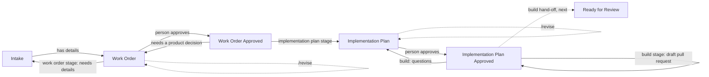

# Agent hub pipeline

The agent hub pipeline: the tracker (Jira or GitHub Projects) hands tickets
to GitHub Actions, where Claude Code does the preparation work — a work
order, then a technical implementation plan, then the code as a draft pull
request (the build, being built) — and the results are written back to the
ticket. People approve each stage before the next starts.

Tickets waiting for a person (Work Order, Implementation Plan, later Ready for
Review) carry the `needs-human` label; approving removes it. Any failure
leaves the ticket where it is, with a comment linking to the run. Commenting `/revise` and what to change asks the agent to revise its
work order or plan (or retry a failed run) — for Jira, see
[Reverse paths](docs/jira.md#reverse-paths-sending-back-and-asking-for-changes).

Any repository can use it: install the hub with its script (this folder and
the `agent-hub-*` workflows — [docs/updating.md](docs/updating.md)), register
a runner, set a few secrets, and connect a tracker — no workflow edits. Jira is ready today; GitHub Projects is being added as an
alternative with the same stages — see [docs/trackers.md](docs/trackers.md). Start
with **[docs/setup.md](docs/setup.md)**.

> By default the agents run on a **self-hosted runner** where Claude Code is
> logged in to a **Claude subscription** (nothing billed per run). Switching to
> the **Claude API** is a secret and a variable — see
> [docs/runners.md](docs/runners.md). Claude is only used when a ticket or a
> person asks for it; tests, hooks and CI never use it — see
> [docs/claude-usage.md](docs/claude-usage.md).

## Workflows

| Workflow | Trigger | What it does | Docs |
|---|---|---|---|
| [`agent-hub-work-order.yml`](../workflows/agent-hub-work-order.yml) | `agent-hub-work-order-requested` from the tracker, or manual | Turns an intake ticket into a structured work order, or returns it for more detail | [work-order.md](docs/workflows/work-order.md) |
| [`agent-hub-implementation-plan.yml`](../workflows/agent-hub-implementation-plan.yml) | `agent-hub-implementation-plan-requested` from the tracker (work order approved), or manual | Researches the codebase and writes a technical implementation plan (attached, with a summary in the ticket), or returns the ticket with questions | [implementation-plan.md](docs/workflows/implementation-plan.md) |
| [`agent-hub-build.yml`](../workflows/agent-hub-build.yml) | `agent-hub-build-requested` from the tracker (plan approved), or manual | Implements the approved plan on `agent-hub/<KEY>` and opens a draft pull request for a person to review, or returns the ticket with questions (being built: an automated review and one fix pass today; the CI gate and hand-off come next) | [build.md](docs/workflows/build.md) |
| [`agent-hub-stage.yml`](../workflows/agent-hub-stage.yml) | Called by the stage workflows above | The steps every stage runs through: fetch the ticket, run the agent, apply the result or send the ticket back | [architecture.md](docs/architecture.md) |
| [`agent-hub-tests.yml`](../workflows/agent-hub-tests.yml) | Pull requests and pushes to `main` that change the hub | Lint + the test suite | [tests/README.md](tests/README.md) |
| [`agent-hub-evals.yml`](../workflows/agent-hub-evals.yml) | Manual | Live Claude evals of the agents' decisions | [evals.md](docs/evals.md) |
| [`agent-hub-sandbox-check.yml`](../workflows/agent-hub-sandbox-check.yml) | Manual | Checks the agents' limits with the real Claude Code, on the pipeline's runner and with its Claude access | [runners.md](docs/runners.md#checking-the-sandbox) |

## Documentation

- [Setup](docs/setup.md) — add the hub to a repository and connect a tracker
- [Installing and updating](docs/updating.md) — versions, the update script, what it replaces and keeps, releasing
- [Choosing a tracker](docs/trackers.md) — Jira or GitHub Projects: what's shared, what differs, and what's ready
- [GitHub Projects setup](docs/github-projects.md) — the foundations: board, statuses, views, labels, intake form and access (stages not connected yet)
- [Jira setup](docs/jira.md) — statuses, labels, rules, sending tickets back and asking for changes (`/revise`), permissions, and what to automate in Jira
- [Extending the stages](docs/extending.md) — add your codebase's knowledge per stage: guidance, review checks, expert agents and skills
- [Architecture and conventions](docs/architecture.md) — how the pipeline is built; the standard every new stage follows
- [Agent evals](docs/evals.md) — checking Claude's decisions: when it's worth the cost, the guards, how
- [When Claude is used](docs/claude-usage.md) — what causes Claude usage, tests vs evals, the eval notice, safeguards
- [Runners and Claude access](docs/runners.md) — self-hosted runner with a Claude subscription, or the Claude API
- [Work order workflow](docs/workflows/work-order.md) — usage, tracker setup, edge cases, known gaps
- [Implementation plan workflow](docs/workflows/implementation-plan.md) — usage, tracker setup, guardrails, edge cases
- [Build stage](docs/workflows/build.md) (a development preview, being built) — what it does today and the full design: flow, review and fixes, CI gate, human gates, safety, the build order and decisions
- [Workflow doc template](docs/workflows/TEMPLATE.md) — start here for a new workflow
- [Contributing](CONTRIBUTING.md) — local setup, checks, and the definition of done
- [Tests](tests/README.md) — what's covered and how to run it
