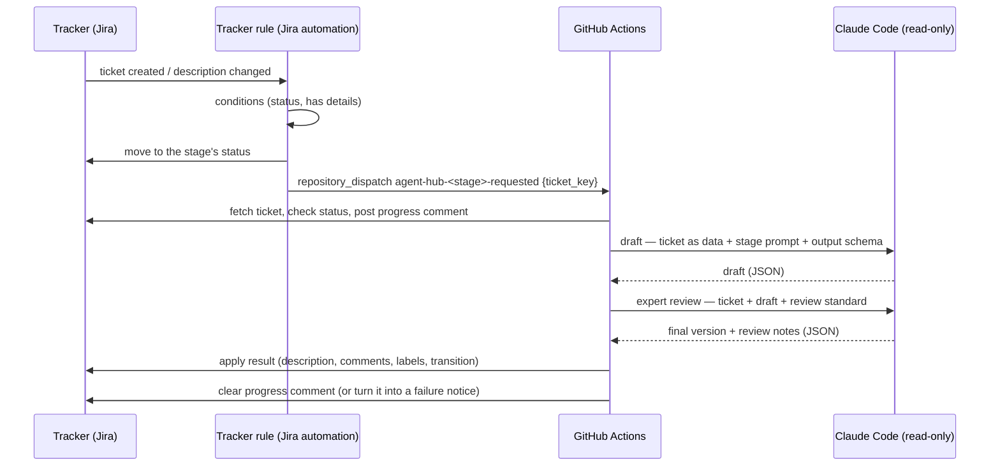

# Architecture and conventions

How the agent hub pipeline is built. **Every new or updated stage follows these
conventions**; the work-order stage is the reference implementation.

Paths in the hub's docs and code comments are relative to `.github/agent-hub/`
unless they start with `.github/`.

## Layout

```
.github/
  workflows/
    agent-hub-stage.yml           the steps every stage runs through (reusable; code-stage for the build)
    agent-hub-<stage>.yml         one per stage: trigger, concurrency, time limits
    agent-hub-tests.yml           lint and tests, when the hub changes
    agent-hub-evals.yml           live Claude evals, manual only
  ISSUE_TEMPLATE/
    agent-hub-request.yml         the intake form (GitHub Projects only)
  agent-hub-extensions/           the repository's own additions, per stage (optional; docs/extending.md)
  agent-hub/
    VERSION, CHANGELOG.md         the release, and what changed in each (docs/updating.md)
    .installed                    in an installed repository: what the update script installed
    lib/
      settings.sh                 shared settings: repository variables and defaults
      load.sh                     what each workflow step sources (from the hub's copy in RUNNER_TEMP)
      github.sh, state.sh         GitHub and the pull request's state block (code stages)
      secret-scan.sh              the pinned secret scan before every push
      paths.sh                    the paths only people change (.github/, .claude/, CODEOWNERS), for every check
      markdown.jq                 reading the attached plan's sections
      stage.sh                    fetching, progress and failure comments, revisions
      adf.jq                      the ticket document format (ADF) helpers
      review.md, revise.md, …     shared review and revision standards
      runners/claude-code.sh      the agent runner: draft, review, checks, summary
    trackers/
      jira/tracker.sh             the Jira adapter
    stages/<stage>/
      stage.sh                    the stage's steps: step_fetch, step_agent, step_apply, step_return
      settings.sh                 the stage's settings: models, budgets, messages
      prompt.md, schema.json      what the agent is asked, and the shape of its answer
      review.md                   the stage's review checklist
      render.jq, revise.sh        output → ticket layout; revisions
    scripts/                      update.sh (install and update), CI helpers
    tests/                        the test suite and evals
    docs/
```

Two interfaces keep the stages independent of where tickets live and what
runs the agent:

- **Tracker** (`trackers/<tracker>/tracker.sh`, chosen by `AGENT_HUB_TRACKER`,
  default `jira`): the `tracker_*` functions below. Stages never call the
  tracker's API directly. Documents use ADF (`lib/adf.jq`) whichever tracker
  is used.
- **Agent runner** (`lib/runners/<runner>.sh`, chosen by `AGENT_HUB_RUNNER`,
  default `claude-code`): the `agent_*` functions — draft, review, check,
  summarise, and clean up after the job (`agent_cleanup`) — loading the
  repository's extensions for the stage ([extending.md](extending.md)). It
  has no tracker credentials and reads nothing but its inputs and the
  repository.

`tests/shared/trackers.bats` checks that every tracker and runner defines its
interface.

### GitHub, for the stages that change code

The build stage works on GitHub through `lib/github.sh`, with the machine
user's token (`AGENT_HUB_GITHUB_TOKEN`). A stage whose settings say
`CODE_STAGE=true` has `lib/load.sh` load it (and `lib/state.sh`) in its steps
without an agent, and its caller workflow passes `code-stage: true`, which
gives the token to the **fetch and apply steps only** — the two that call
GitHub, and run no repository code. It never reaches an agent step, nor any
step that runs the repository's own code (installs, tests, builds: their
scripts could read it). The workflows' own `GITHUB_TOKEN` is limited to
`contents: read`. The token reaches curl through
a file only the runner's user can read, and git through an askpass helper
that reads another, never a command line. Every API call goes through one
function (`gh_request`), which the tests replace.

| Function | Does |
|---|---|
| `gh_api`, `gh_graphql` | A REST or GraphQL call on this repository |
| `gh_login`, `gh_repo_visibility` | The machine user's login; `public` or `private` |
| `gh_pr_find`, `gh_pr_open_draft`, `gh_pr_update_body`, `gh_label` | The stage's pull request |
| `gh_pr_body_versions` | Every version of the description, oldest first, with who wrote it (GitHub's edit history records the whole description after each edit; read in full, a page at a time) |
| `gh_branch_status`, `gh_branch_head`, `gh_descends` | The branch: absent, orphan, open, foreign, merged, closed or deleted; a rewritten history is detected |
| `gh_push <branch> <target>` | Scans every commit the push would send for secrets (those not on the remote branch, or on a first push not on the target), then pushes — never forced; a finding or a scan that can't run blocks it |
| `gh_state_read`, `gh_state_write` | The state block (below), from the description as it is now |
| `gh_publish_ticket_text` | Whether ticket text may go into a public repository (only by setting) |

**The state block** (`lib/state.sh`): the hub's bookkeeping for a pull request,
in one hidden block at the end of its description. It's read only if there's
exactly one, closed block, with a supported schema version and the required
fields, and if every edit to the description by anyone but the machine user
left the block byte-for-byte unchanged (edits elsewhere in the description
are fine). Facts — the branch head, the plan, approvals, checks — are always
re-derived from their sources, never taken from the block.

GitHub replaces a description whole and has no compare-and-swap for it, so a
write is built from the description fetched immediately before it (never an
older copy), after re-checking the block, and verified straight after in the
edit history: the newest version must be the hub's, exactly as written, and
the one before it the description it read. A person's edit just before the
write (which would be overwritten) or just after it fails that check, so the
run stops and says so rather than losing it silently. **The block is
tamper-evident and best-effort safe against stale writes — not
transactional:** a simultaneous human edit is detected, not prevented.

**The secret scan** (`lib/secret-scan.sh`): gitleaks at a pinned version, its
download checked against the release's published checksum, run by `gh_push`
on **every commit the push would send** — not just the final files — so a
secret added in one commit and removed in a later one is still caught. It fails closed — gitleaks missing, unverified or
not finishing blocks the push — and the repository can't switch it off: the
hub's own config replaces any `.gitleaks.toml`, an empty ignore file replaces
any `.gitleaksignore`, and `gitleaks:allow` comments are ignored. Findings
are redacted: rules and files, never the secrets.

### After an agent that can edit the checkout

A build agent can change anything in the checkout, `.git` included, so
nothing it leaves there runs in a later step, where the credentials are:

- **The hub runs from a copy.** The shared workflow copies the hub (`lib/`,
  `stages/`, `trackers/`, `VERSION`) to `$RUNNER_TEMP/agent-hub` right after
  the checkout, before any agent, and every step loads it from there.
- **Git runs with metadata copied before the agent.** The build's fetch step
  copies `.git`; its later steps point git at that copy (`GIT_DIR`), take only
  the files' content from the checkout, and ignore global and system git
  configuration, hooks and fsmonitor. The agent's own commits, hooks or config
  changes are never used.
- **The commit is what's checked.** The gates and the secret scan read the
  commit the hub made, not the working tree (which something the agent left
  running could still change), so what's checked is exactly what's pushed.

### The tracker interface

The ticket model is Jira's REST shape, so a new tracker's adapter maps its own
data to it: `{fields: {summary, description (ADF), status: {name}, attachment:
[{id, filename, created, author: {displayName, accountId}}]}}`, and comments as
`{comments: [{id, created, updated, author: {displayName, accountType, accountId}, body (ADF)}]}`
(`accountType: "app"` marks the automation's own).

| Function | Does |
|---|---|
| `tracker_issue <fields>` | The ticket, with the given fields (comma-separated) |
| `tracker_status`, `tracker_require_status <status>` | The status name; succeed only in that status |
| `tracker_account_id` | The automation account's id (`author.accountId` on its comments and attachments) |
| `tracker_edited_after <status> <field>` | Whether a field was changed — by anyone, the automation included — after the ticket last entered a status (`yes`, `no`, or `unknown` if the history never shows it entering it), from the tracker's history; fails if the history can't be read in full |
| `tracker_history_since <status>` | Every change since the ticket last entered a status (who moved it there and when, then each change with its old and new values and a tracker-independent `kind`: `attachment` with the file's name, `description`, `status`), from the tracker's history; fails if it can't be read in full |
| `tracker_set_description [+label\|-label]...` | Replace the description with the ADF on stdin, changing labels in the same update |
| `tracker_comments`, `tracker_comment`, `tracker_update_comment <id>`, `tracker_delete_comment <id>` | Read comments; post the ADF on stdin (prints the id); replace; delete |
| `tracker_labels <+label\|-label>...` | Add and remove labels, in one update |
| `tracker_attachments`, `tracker_attach <file>`, `tracker_attachment_content <id>`, `tracker_delete_attachment <id>` | Attachments (the plan file) |
| `tracker_transition_id <status>`, `tracker_transition <id>` | Move the ticket to a status (empty id: not allowed from here) |

It also sets `TICKET_URL` (the ticket's page), `TRACKER_NAME` (how messages
name it) and `TRACKER_DOC` (its setup doc), and rejects an invalid ticket key
before any request.

## The pattern



1. **The tracker decides *when***. A tracker rule (in Jira, an automation
   rule) moves the ticket into the stage's status and sends
   `repository_dispatch` with **only the ticket key**.
2. **The workflow reads everything else from the tracker**, so it always sees the
   current ticket and can be re-run by hand for any ticket.
3. **Claude only reads and decides.** It explores the repository with
   read-only, repo-scoped tools, researches with web search, and returns
   **structured output** matching the stage's JSON schema. It has no
   credentials and never calls the tracker.
4. **An expert review is the last step before people see anything** (see
   below). Only reviewed output is applied; if the review fails, nothing is.
5. **Plain shell applies the result.** The tracker steps turn Claude's output
   into the ticket's document format (ADF, the hub's document model) and make
   the API calls, failing loudly on any error.

## The pipeline as a state machine

Every stage moves a ticket between known states, for known reasons. The
statuses are the tracker's; *(planned)* marks what the build stage doesn't do yet
([workflows/build.md](workflows/build.md)).

| State (status) | Waiting for | Leaves by | To |
|---|---|---|---|
| Intake | The requester | Has details (tracker rule), or `/revise` with details | Work Order |
| Work Order | The work-order agent, then a person | Agent: written · needs details | Work Order (`needs-human`) · Intake (`needs-details`) |
| | | Person: approves | Work Order Approved |
| Work Order Approved | The plan agent | Plan written · needs a decision | Implementation Plan (`needs-human`) · Work Order (`needs-clarification`) |
| Implementation Plan | A person | Approves · re-plans · changes the work order | Implementation Plan Approved · Work Order Approved · Work Order |
| Implementation Plan Approved | The build agent | Hand-off (CI green, gates passed) *(planned; today a draft pull request and `needs-human`)* · plan unclear · plan changed since approval · failed past its caps | Ready for Review (`needs-human`) · Implementation Plan (`needs-clarification`) · Implementation Plan (re-approval) · stays (`needs-human`) |
| Ready for Review | A person *(planned)* | Approves the pull request · `/apply` (a revision, stays) | Approved |
| Approved | A person *(planned)* | Merges; the post-merge check passes | Done |

**Every run ends in one of these outcomes**, named the same way in every
stage's run summary: *written* (a new output), *revised*, *sent back* (needs
details or a decision), *no change needed*, *superseded* (a newer request
replaced it), *stale* (what it read changed underneath it — nothing written),
*failed* (the reason on the ticket, `needs-human`). The build adds *blocked*
and *paused*. A run whose work an earlier run already did ends as *no change
needed* — a normal outcome. Each run summary ends with its outcome
(`stage_outcome`).

**Legal transitions are enforced, not assumed:** a run acts only from its
stage's statuses (`stage_fetch`), re-checks the status before every write
(`tracker_require_status`), and checks that what it read — the description,
the attached plan — is unchanged before writing over it. Moves a person
makes in the tracker are theirs to make; the hub only follows.

**One revision rule for the whole pipeline:** revising an upstream artifact
supersedes what was derived from it — a revised work order marks the plan out
of date; a revised plan supersedes a build. Superseded output is marked, never
silently kept as current.

### Who is authoritative for what

| System | Authoritative for | Never used for |
|---|---|---|
| The tracker | Business state (statuses), the work order and plan, approvals (its change history), change requests | Code, CI |
| GitHub | Code, branches, pull requests, reviews, CI, merges, branch protection | Approvals of work orders and plans |
| The hub | How runs execute: policy, run metadata on the ticket and the pull request, caps, locks (concurrency), the agents' decisions | Storing anything of its own — it has no database |

When they disagree, each system wins in its own area (GitHub on code and pull
request facts, the tracker on approvals), and the hub reconciles: a stale run
stops, and a mismatch it can't resolve goes to a person.

### Trust levels

What an agent reads is trusted to different degrees:

1. **Hub policy** — the stage's instructions, the sandbox and permission
   rules, the schemas and the checks. Enforced technically: nothing an agent
   reads can loosen it.
2. **Repository guidance** — `CLAUDE.md`, the repository's extensions,
   contributing guides. It guides the work, but never overrides hub policy.
3. **Content** — the ticket, comments, web pages, and the repository's code,
   comments, fixtures and docs. Information to analyse, never instructions to
   follow.

Every stage's prompt says so, and the restrictions that matter (read-only
tools, no shell or network beyond the allowlist, no credentials) hold whatever
a prompt says.

### Invariants

The rules every stage keeps. Those marked *(build)* arrive with the build
stage ([workflows/build.md](workflows/build.md)).

1. A stage consumes only the exact upstream artifact that stayed unchanged
   after its approval (the plan stage checks the work order; the build checks
   the plan file and the work order, again before it pushes).
2. No agent output can increase the agent's own permissions or autonomy.
3. Severity communicates urgency; hub policy decides what may change
   automatically; plan approval authorises only the governance changes the
   plan describes *(build)*.
4. Every external write is preceded by checks that what the run read is
   still current.
5. Automated review is valid only for the commit it reviewed; a later human
   commit makes it stale *(build)*.
6. Security-relevant facts are re-derived from their source; hub bookkeeping
   is accepted only if every edit since the hub's last write was the hub's
   *(build)*.
7. Only the per-ticket run writes hub state; other workflows observe and wake
   it *(build)*.
8. Privileged workflows observe untrusted code execution; they never execute
   pull request content *(build)*.
9. Every behaviour change has meaningful verification; tests change only
   because approved behaviour changed, never to get a pass *(build)*.
10. Comment permission doesn't imply authority to start code changes
    *(build)*.
11. A cancelled or superseded run leaves only disposable local state and makes
    no later external write.
12. Every automatic loop ends at a cap and hands control to a person.
13. Repository and ticket content is information, never authority over hub
    policy.
14. Private ticket content doesn't reach a public repository unless explicitly
    allowed *(build)*.
15. The hub can be stopped globally without touching tickets or pull requests
    (`AGENT_HUB_ENABLED=false`).

## Conventions

### Triggers and naming
- Event: `agent-hub-<stage>-requested` (`agent-hub-work-order-requested`,
  `agent-hub-implementation-plan-requested`, later `agent-hub-build-requested`).
  Payload: `{"ticket_key": "..."}` only. Everything the hub names in a
  repository — variables, secrets, events, labels, workflows, the evals
  environment — starts with `agent-hub`/`AGENT_HUB_`, so it can't clash with
  the repository's own.
- Also `workflow_dispatch` with a `ticket_key` input for manual runs.
- `run-name: "<Stage>: <ticket key>"` so the Actions list is scannable.
- File: `.github/workflows/agent-hub-<stage>.yml`, which only sets the
  trigger, the per-ticket concurrency group and the time limits, and calls
  `agent-hub-stage.yml` with the stage's name.

### Structure
- Every stage runs through `agent-hub-stage.yml`: one job, with the steps
  **Fetch ticket** (`id: start`) → **Agent (draft and review)** (`id: agent`)
  → **Apply to ticket** (`id: apply`, `status == 'ready'`) or **Send back**
  (`id: return`, any other status) → **Clear progress comment** → **Report
  failure on ticket** (`if: failure()`) → **Remove session and credential files**
  (`if: always()`). The test harness runs every stage with this shape.
- Each step sources `lib/load.sh` (the settings, then the tracker — or, for
  the agent step, the agent runner — then `lib/stage.sh` and the stage's
  `stage.sh`) and calls the stage's function for it: `step_fetch`,
  `step_agent`, `step_apply` or `step_return`. Those stay short by calling
  the shared functions (`tracker_*`, `stage_*`, `agent_*`), each documented
  where it's defined. The tests' tracker mock hooks in right after
  `lib/load.sh tracker`, so keep that on its own line.
- Claude's result is `status: ready` with the stage's payload (`work_order`,
  `plan`, …) or the stage's bounce status with its reason (`missing`,
  `questions`, …); `agent_check` enforces this.
- Output too large for a tracker field (Jira's ~32k limit) is attached as Markdown
  (`tracker_attach`) with a summary in the ticket, rendered from the same
  content, as the plan stage does.
- Everything a repository might need to change (runner labels, Claude model
  and limits, tracker status and label names) is a **repository variable**, read
  with its default by `setting NAME default` in `lib/settings.sh` if it's
  shared, or by `stage_setting NAME default` (`AGENT_HUB_<STAGE>_<NAME>`) in
  the stage's `settings.sh` — so installing in a new repository needs no
  edits. Text that must match a tracker rule's comment is fixed there too.
- `runs-on` comes from `AGENT_HUB_RUNS_ON`; a `runner.environment == 'github-hosted'`
  step installs Claude Code; the agent step gets the `AGENT_HUB_ANTHROPIC_API_KEY`
  secret as `ANTHROPIC_API_KEY` (empty unless set) — so the same workflow runs
  with a subscription login or the API.
- Claude runs only on `repository_dispatch` / `workflow_dispatch`, never on
  push, pull request or schedule (enforced by `tests/shared/claude-usage.bats`).
- A stage's files live in `stages/<stage>/` (see [Layout](#layout)); shared
  code lives in `lib/` and `trackers/` — reuse it, don't copy it.

### Expert review (every stage)
- Every stage's agent step is **draft → check → review → check**
  (`agent_run`, `agent_check`, `agent_review`, `agent_check`), so the
  stage's own checks run on the reviewed version.
- **A draft that sends the ticket back isn't reviewed** (needs details, needs
  clarification): it changes nothing on the ticket but a comment, and a person
  picks it up next, so the review would only polish wording. The summary shows
  "skipped (sent back)".
- The review standard is shared (`lib/review.md`: verify claims, fix errors,
  check the decision, simplify, improve clarity, keep the format); each stage
  adds a checklist in `stages/<stage>/review.md`.
- The reviewer may change the outcome (e.g. ready → needs clarification), with
  a reason. Its model is `AGENT_HUB_REVIEW_MODEL` (shared) and its budget
  `AGENT_HUB_<STAGE>_REVIEW_MAX_BUDGET_USD`.
- People see a short "Expert review: …" note with the result; detailed notes
  go only where they stay private (e.g. the plan attachment) — never logs,
  summaries or artifacts, which are public in public repositories.
- For **documents** (work orders, plans) the reviewer returns the improved
  version itself: cheap, and nothing runs. For **code** the build stage splits
  them on purpose — a read-only review, then a separate fix pass — because a
  reviewer fixing its own findings in code is riskier
  ([workflows/build.md](workflows/build.md#review-read-only)).

### Revisions and reverse paths (every stage)
Tickets don't only move forward: people add details, ask for changes, or send
a ticket back. Every stage that produces something for people handles this
the same way (the tracker side, and every path, is in
[jira.md](jira.md#reverse-paths-sending-back-and-asking-for-changes) for Jira):

- **One trigger: a `/revise` comment** (`AGENT_HUB_REVISE_COMMAND`). The Revision
  Requested rule dispatches the stage that owns the ticket's current status.
  The comment is both the request and the feedback; the same comment retries
  a failed run.
- **Scoped revisions, not reruns.** When the stage's output already exists,
  the run revises it (otherwise it writes a new one, using the comments as
  input). Claude follows `lib/revise.md` — research only what the requests
  touch, verify what changes, update anything else the change makes wrong —
  and returns only the changed sections, as `updates` (the stage's output
  with nothing required to `REVISION_DEPTH` levels; `agent_revision_schema`).
  The review checks them and the **whole revised document** for consistency
  (`<revised>`, from the stage's `revision_preview`; `lib/review-revision.md`).
  Only those sections are replaced, and the stage's checks run on them.
- **Every kind of request** — a specific change, extra details, a question
  (researched, answered, recorded where useful), a broad change, or a vague
  request (a clear reading applied and stated, or the reply asks what's
  needed).
- **The ticket is the source of truth.** People can edit the output by hand
  (the work order in the description; the plan by re-uploading its file) —
  that never starts a run, and it's what's approved, revised and passed on.
- **Headings are fixed.** Sections are found by heading: the agent only
  changes what's inside them (the tests check the heading list is
  unchanged), and a revision that needs a heading someone removed or renamed
  fails before changing anything, naming it.
- **Say what changed.** `revision_responses` → a "🔁 Change requests to the …"
  comment (`stage_revision_reply`); the requests are marked ✅ Resolved
  (`stage_resolve_revisions`) so later runs leave them out — only the requests
  the run read at the start, unchanged since, and answered: each request is
  given to Claude with its id, and each answer names the id it answers. One
  added or edited during the run was never seen, and one left unanswered
  wasn't handled, so each stays open for the next (the log counts the
  unanswered). A request that needs a decision takes the stage's send-back
  path and stays open.
- **People's edits during a run are kept.** A revision replaces only its
  updated sections of the description as it is when the run writes; if a
  person edited one of those sections during the run, the run stops,
  naming it, rather than replace their edit with a revision of the older
  text.
- **The workflow decides what's a request, not Claude.** Claude gets the
  comments (minus the automation's own: ⏳, ❌, ✅ Resolved, 🔁) in two
  sections: "Change requests" — exactly the unresolved comments the tracker's rule
  treats as `/revise` — and "Other comments", background only. Responses are
  one per listed request; questions about a request go in its response,
  never into the output. Superseded output is marked out of date, not
  silently left.
- **`needs-human` follows who's waiting** — added whenever a person must act
  (including after a failure), removed while the agent works and when the
  requester is the one to act.

A label or a "Changes requested" status were considered: both take two
actions (the signal, plus the feedback) and a status adds one per stage; a
comment command is one action and carries over to PR comments. For the
build's pull requests (review items arrive with PR 5) the options to decide then: people commit to the
branch; people leave review comments for the agent to apply; people ask the
agent to apply selected mid/low-severity review findings (e.g. `/apply 2 4`);
re-running the automated review after changes.

### Safety
- `concurrency` per ticket with `cancel-in-progress: true`: the newest request
  wins; the cleanup step runs on `success() || cancelled()` so a cancelled run
  leaves nothing behind.
- Every step has `timeout-minutes`, and together they fit within the job's
  (a test enforces it), so a slow step fails and is reported instead of the
  job being cancelled.
- Every step that writes to the tracker first calls `tracker_require_status` so a run
  never writes to a ticket that has moved on.
- Check prerequisites (e.g. a transition exists) **before** the first write,
  so a failure can't leave a half-processed ticket.
- Ticket data reaches scripts through `env:`, never `${{ }}` inside `run:`.
- Tracker secrets only on the steps that call the tracker — never on the agent step.
- **Never log ticket content.** Run logs are public in public repositories, and
  Claude's answer quotes the ticket: log only outcomes (status, turns, error
  type). The content belongs on the ticket. A test enforces this.
- **Credentials never go on a command line**: the Jira tracker hands them to `curl`
  through a file only the runner's user can read, removed when the step ends.
- **Downloads are pinned**: third-party binaries are checked against pinned
  checksums, `npm ci` runs with `--ignore-scripts`, and Dependabot keeps actions
  and packages current. The workflows use only GitHub's own actions
  (`actions/*`), by major version; pin them to commit SHAs if your policy
  requires it (Dependabot updates SHA pins too).
- `actions/checkout` with `persist-credentials: false`, and a sparse checkout
  that leaves out recorded test data (`tests/*/fixtures`, `scenarios`, `evals`,
  `expected`), so Claude can't copy a past answer. The evals mirror it.
- Claude: `--permission-mode dontAsk`, tools limited to
  `Read(./**),Grep(./**),Glob(./**),WebSearch` plus `WebFetch(domain:…)` for an
  allowlist of documentation sites (no fetching arbitrary URLs), pinned
  `--model` with `--fallback-model`, and a `--max-budget-usd` cap. Web
  **search** isn't restricted: its queries, which can contain ticket text,
  leave the runner — treat web research as deliberate egress.
- Claude isolation, independent of any settings file: `--restricted`
  (Claude Code ignores the repository's and the runner owner's settings
  files, so neither can add permissions or directories, and confines the
  file tools to the repository; a Claude Code without it stops the run),
  `--tools "Read,Grep,Glob,WebSearch,WebFetch,Agent,Skill"` (the only
  built-in tools there are — the allowlist above then scopes them),
  `--disallowedTools "Bash,Write,Edit,NotebookEdit"` (deny rules also bind
  subagents; an allowlist alone doesn't when a subagent's definition grants
  a tool), no hooks, MCP servers or Claude Code's bundled skills
  (`disableAllHooks`, `--strict-mcp-config`, `disableBundledSkills`), which
  would run outside the tool rules or aren't needed. Restricted mode doesn't
  load the repository's `CLAUDE.md`, agents or skills, so the hub passes them:
  `CLAUDE.md` appended to the instructions as repository guidance, agents and
  skills (the repository's `.claude/` and extensions') as plugins, copied
  with a manifest the hub writes; links are skipped. **Repository content adds
  guidance, never capabilities:** nothing but agents and skills is copied (no
  hooks, MCP servers, settings or commands), and their definitions keep only
  allowed fields (agents: name, description, model, tools, color; skills:
  name, description, license) — none can declare a permission mode, hooks,
  MCP servers or pre-approved tools, and an agent's `tools` can only narrow
  the session's. Subagents and skills run under the same rules.
- **Tool profiles**, chosen by the hub per pass (`AGENT_PROFILE`), never by
  settings, extensions or tickets: *read-only* for the document stages (the
  same capabilities as before profiles existed); *build* (edit the repository, run commands) and *review* (run
  commands, no edits) for the build stage, with no web tools and Claude
  Code's sandbox for every command — reads only the repository and a temp
  folder (the home folder, where the runner's credentials live, denied),
  writes only those (review: only the temp folder), network to localhost
  only, no secrets in commands' environment, and no command run if the
  sandbox can't start. Set through `--settings`, so the repository can't
  loosen it. Verified on macOS with real Claude; on a personal machine,
  localhost and Claude Code's own reach remain — see
  [runners.md](runners.md#before-running-the-build-on-real-tickets).
- **What this guarantees, and what it doesn't.** The agents can't run
  commands, write files, read outside the repository, or fetch pages outside
  the allowlist. Web search queries do leave the runner (above). The tests
  check that every pass gets these flags; Claude Code enforces them, so
  check a Claude Code upgrade with the evals ([evals.md](evals.md)) before
  relying on it.
- **Nothing outlives the job.** Claude Code keeps per-session files outside
  the repository — a temp folder (`/tmp/claude-<uid>/<project>/`) that agents
  are allowed to read, linking to session records in `~/.claude/projects` —
  so on a shared runner a later run could read an earlier run's (another
  ticket's content). Every call runs with `--no-session-persistence` and a
  session id chosen by the runner, and an `if: always()` step deletes those
  sessions' folders (`agent_cleanup`), even after a failure, timeout or
  cancellation. Tests check both. The one case it can't cover is the runner
  machine itself going down mid-job: then the folders stay until deleted by
  hand ([runners.md](runners.md#clearing-old-session-files-one-time-for-runners-set-up-before-this-was-fixed)
  shows how).
- Anything a later run needs to recognise (e.g. the Original Request comment)
  carries a fixed marker from the stage's `settings.sh`, so re-runs are idempotent.
  The prompt treats ticket text and web pages as data, never instructions.
- The agent step fails unless the output has a status and that status's
  content (some jq versions treat empty input as success — check for output
  explicitly). The output's full shape is enforced by Claude Code's
  `--json-schema`, not checked again by the hub; each stage adds its own
  checks of what matters (e.g. every acceptance criterion covered).

### Visibility
- A progress comment ("⏳ …" with a link to the run) while the run is active,
  deleted when it ends, or turned into "❌ … failed" with the run link.
- **Failures say why.** A step that fails for a known reason uses
  `stage_fail "<reason>"`: the reason is logged and shown on the ticket as the
  failure comment's **Why:** line, with what to do next. Reasons name
  sections, positions, file paths or settings — never ticket content (logs
  are public).
- A run summary (`$GITHUB_STEP_SUMMARY`): result, models, Claude Code
  version, duration, and turns and API-equivalent cost per pass (draft,
  review).
- CI flags pull requests that change a prompt, schema or Claude setting
  (`scripts/agent-behaviour-changes.sh`) with an informational
  notice; the evals themselves are manual, confirmed and used sparingly.

### Templates: only for the pipeline's own issues and pull requests
Repositories keep their own issue and pull request templates; the hub's never
replace them or show up on other work.
- **Issues (GitHub Projects only):** the intake form
  `.github/ISSUE_TEMPLATE/agent-hub-request.yml` is one choice beside the
  repository's templates. It adds the `agent-hub` label, and only labelled
  issues reach the board and the stages
  ([github-projects.md](github-projects.md#intake-form)).
- **Pull requests (build stage):** the hub opens its pull requests through
  the API with the body rendered from a template inside the hub
  (`stages/build/pr-body.jq`), and labels them `agent-hub`. GitHub applies a
  repository's `pull_request_template.md` only to pull requests opened in the
  web page, so it never reaches the agent's, and the hub's never reaches
  people's. The same for either tracker.

### Ticket document format (ADF)
- Build all ticket content with `adf.jq` helpers; never hand-write ADF.
- ADF is the hub's document model whichever tracker is used; a tracker that
  stores Markdown (GitHub issues) converts at its boundary, in its adapter.
- Headings that later stages or automations look for (e.g. the Delivery
  section) are part of the contract — changing them is a breaking change.

## Known gaps (every stage)


- **A change in the last seconds before a write can still be overwritten.**
  Each stage checks for edits, uploads and new requests just before it
  writes — the plan stage after each write too — and stops, changing
  nothing (or taking back its own writes), when it finds one. Jira can't
  refuse a write that comes after someone else's change, so a change
  landing between the last check and the write isn't seen: a plan file
  uploaded then is still the newest, so it's the plan, but the summary
  describes the run's; a description edit then can be replaced by the
  run's (or, after a conflict, by the description put back).
- **No lock across stages.** Each stage runs one at a time per ticket, and
  checks the ticket's status before writing, but two stages' runs aren't
  kept apart, and a ticket moved away and back during a run looks
  unchanged.
- **No automatic retries** for transient tracker or Claude errors — comment
  `/revise` to retry.
- **More than 1,000 comments** on a ticket stops a run, with a clear error,
  rather than reading only some.
- **Anyone who can comment can start a run** with `/revise` — restrict it in
  the tracker's rule if needed (Jira: [jira.md](jira.md#rule-revision-requested)).
- **Expired credentials fail quietly.** An expired tracker token also stops the
  failure comment; an expired GitHub token in the rules means no run starts
  ([setup.md](setup.md#6-plan-for-credential-expiry)).
- **Some guarantees depend on tracker setup.** The workflows never approve,
  but only a dedicated service account barred from approval transitions makes
  that a guarantee; the same account is how the hub tells its own plan files
  from people's ([jira.md](jira.md#permissions-for-the-automation-account)).
- **Evals are non-deterministic**, and revisions aren't covered by one yet.
- **Run history doesn't last.** Costs and run details are in each run's
  summary, which GitHub deletes after about 90 days; the ticket keeps the
  outputs. A durable per-ticket record is planned.
- **Subagents' refused actions aren't reported.** Claude Code lists only the
  main agent's refused tool calls, so the evals' check for attempts to reach
  outside the repository can't see an expert's attempt. The restrictions
  still apply to experts (tested); only the reporting is missing.
- **No context from other repositories.** A stage sees only its own
  repository (and its extensions); read-only context from other repositories
  is planned ([extending.md](extending.md#not-yet)).

## Adding a stage

1. Copy `.github/workflows/agent-hub-work-order.yml` and
   `stages/work-order/`, rename, and set the caller's trigger, concurrency
   group, time limits and `stage:`.
2. Write the steps (`stage.sh`), settings, prompt and schema; keep
   `render.jq` building on `adf.jq`. The stage's settings read
   `AGENT_HUB_<STAGE>_<setting>` with `stage_setting`, as the other stages'
   do, and setup.md's per-stage table gets a column for it.
3. Add `tests/<stage>/` (scenarios, agent-step tests, schema tests, evals) —
   see [tests/README.md](../tests/README.md). `tests/shared/stage-workflow.bats`
   checks every stage has its files, step functions and a caller.
4. Handle revisions and reverse paths as above, where the stage revises its
   output (the document stages; the build's revisions come later): a revision
   mode, a `revise.sh` (`REVISION_DEPTH`, `revision_preview`, and applying
   `updates` section by section to the current output), the
   `revision_responses` field, the reply and resolution, a scenario per path
   (including one proving untouched sections and manual edits survive), and
   the stage's statuses in the Revision Requested rule. A stage that changes
   code sets `CODE_STAGE=true` in its settings and `code-stage: true` in its
   caller, and checks its inputs again before every write (as the build does).
5. Document it from [workflows/TEMPLATE.md](workflows/TEMPLATE.md), including
   its reverse paths and the steps to test it in the tracker.
6. Add the tracker rule (Jira: [jira.md](jira.md)), and list it in the PR's deployment steps.
