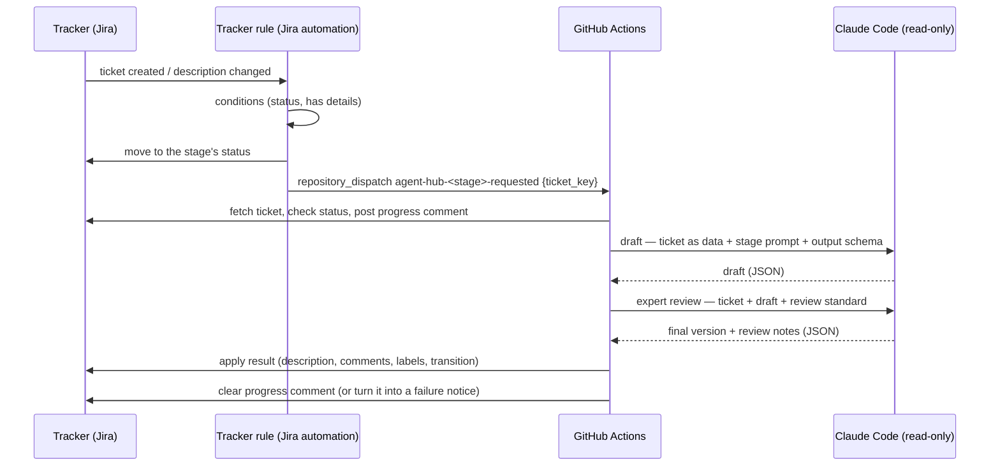

# Architecture and conventions

How the agent hub pipeline is built. **Every new or updated stage follows these
conventions**; the work-order stage is the reference implementation.

Paths in the hub's docs and code comments are relative to `.github/agent-hub/`
unless they start with `.github/`.

## Layout

```
.github/
  workflows/
    agent-hub-stage.yml           the steps every stage runs through (reusable)
    agent-hub-<stage>.yml         one per stage: trigger, concurrency, time limits
    agent-hub-tests.yml           lint and tests, when the hub changes
    agent-hub-evals.yml           live Claude evals, manual only
  ISSUE_TEMPLATE/
    agent-hub-request.yml         the intake form (GitHub Projects only)
  agent-hub-extensions/           the repository's own additions, per stage (optional; docs/extending.md)
  agent-hub/
    VERSION
    lib/
      settings.sh                 shared settings: repository variables and defaults
      load.sh                     what each workflow step sources
      stage.sh                    fetching, progress and failure comments, revisions
      adf.jq                      the ticket document format (ADF) helpers
      review.md, revise.md, …     shared review and revision standards
      runners/claude-code.sh      the agent runner: draft, review, checks, summary
    trackers/
      jira/tracker.sh             the Jira adapter
    stages/<stage>/
      stage.sh                    the stage's steps: step_fetch, step_agent, step_apply, step_return
      settings.sh                 the stage's settings: models, budgets, messages
      prompt.md, schema.json      what the agent is asked, and the shape of its answer
      review.md                   the stage's review checklist
      render.jq, revise.sh        output → ticket layout; revisions
    scripts/                      CI helpers
    tests/                        the test suite and evals
    docs/
```

Two interfaces keep the stages independent of where tickets live and what
runs the agent:

- **Tracker** (`trackers/<tracker>/tracker.sh`, chosen by `AGENT_HUB_TRACKER`,
  default `jira`): the `tracker_*` functions below. Stages never call the
  tracker's API directly. Documents use ADF (`lib/adf.jq`) whichever tracker
  is used.
- **Agent runner** (`lib/runners/<runner>.sh`, chosen by `AGENT_HUB_RUNNER`,
  default `claude-code`): the `agent_*` functions — draft, review, check,
  summarise, and clean up after the job (`agent_cleanup`) — loading the
  repository's extensions for the stage ([extending.md](extending.md)). It
  has no tracker credentials and reads nothing but its inputs and the
  repository.

`tests/shared/trackers.bats` checks that every tracker and runner defines its
interface.

### The tracker interface

The ticket model is Jira's REST shape, so a new tracker's adapter maps its own
data to it: `{fields: {summary, description (ADF), status: {name}, attachment:
[{id, filename, created, author: {displayName}}]}}`, and comments as
`{comments: [{id, created, author: {displayName, accountType}, body (ADF)}]}`
(`accountType: "app"` marks the automation's own).

| Function | Does |
|---|---|
| `tracker_issue <fields>` | The ticket, with the given fields (comma-separated) |
| `tracker_status`, `tracker_require_status <status>` | The status name; succeed only in that status |
| `tracker_set_description` | Replace the description with the ADF on stdin |
| `tracker_comments`, `tracker_comment`, `tracker_update_comment <id>`, `tracker_delete_comment <id>` | Read comments; post the ADF on stdin (prints the id); replace; delete |
| `tracker_add_label <name>`, `tracker_remove_label <name>` | Labels |
| `tracker_attachments`, `tracker_attach <file>`, `tracker_attachment_content <id>`, `tracker_delete_attachment <id>` | Attachments (the plan file) |
| `tracker_transition_id <status>`, `tracker_transition <id>` | Move the ticket to a status (empty id: not allowed from here) |

It also sets `TICKET_URL` (the ticket's page), `TRACKER_NAME` (how messages
name it) and `TRACKER_DOC` (its setup doc), and rejects an invalid ticket key
before any request.

## The pattern



1. **The tracker decides *when***. A tracker rule (in Jira, an automation
   rule) moves the ticket into the stage's status and sends
   `repository_dispatch` with **only the ticket key**.
2. **The workflow reads everything else from the tracker**, so it always sees the
   current ticket and can be re-run by hand for any ticket.
3. **Claude only reads and decides.** It explores the repository with
   read-only, repo-scoped tools, researches with web search, and returns
   **structured output** matching the stage's JSON schema. It has no
   credentials and never calls the tracker.
4. **An expert review is the last step before people see anything** (see
   below). Only reviewed output is applied; if the review fails, nothing is.
5. **Plain shell applies the result.** The tracker steps turn Claude's output
   into the ticket's document format (ADF, the hub's document model) and make
   the API calls, failing loudly on any error.

## Conventions

### Triggers and naming
- Event: `agent-hub-<stage>-requested` (`agent-hub-work-order-requested`,
  `agent-hub-implementation-plan-requested`, later `agent-hub-build-requested`).
  Payload: `{"ticket_key": "..."}` only. Everything the hub names in a
  repository — variables, secrets, events, labels, workflows, the evals
  environment — starts with `agent-hub`/`AGENT_HUB_`, so it can't clash with
  the repository's own.
- Also `workflow_dispatch` with a `ticket_key` input for manual runs.
- `run-name: "<Stage>: <ticket key>"` so the Actions list is scannable.
- File: `.github/workflows/agent-hub-<stage>.yml`, which only sets the
  trigger, the per-ticket concurrency group and the time limits, and calls
  `agent-hub-stage.yml` with the stage's name.

### Structure
- Every stage runs through `agent-hub-stage.yml`: one job, with the steps
  **Fetch ticket** (`id: start`) → **Agent (draft and review)** (`id: agent`)
  → **Apply to ticket** (`id: apply`, `status == 'ready'`) or **Send back**
  (`id: return`, any other status) → **Clear progress comment** → **Report
  failure on ticket** (`if: failure()`) → **Remove agent session files**
  (`if: always()`). The test harness runs every stage with this shape.
- Each step sources `lib/load.sh` (the settings, then the tracker — or, for
  the agent step, the agent runner — then `lib/stage.sh` and the stage's
  `stage.sh`) and calls the stage's function for it: `step_fetch`,
  `step_agent`, `step_apply` or `step_return`. Those stay short by calling
  the shared functions (`tracker_*`, `stage_*`, `agent_*`), each documented
  where it's defined. The tests' tracker mock hooks in right after
  `lib/load.sh tracker`, so keep that on its own line.
- Claude's result is `status: ready` with the stage's payload (`work_order`,
  `plan`, …) or the stage's bounce status with its reason (`missing`,
  `questions`, …); `agent_check` enforces this.
- Output too large for a tracker field (Jira's ~32k limit) is attached as Markdown
  (`tracker_attach`) with a summary in the ticket, rendered from the same
  content, as the plan stage does.
- Everything a repository might need to change (runner labels, Claude model
  and limits, tracker status and label names) is a **repository variable**, read
  with its default by `setting NAME default` — in `lib/settings.sh` if it's
  shared, in the stage's `settings.sh` if not — so installing in a new
  repository needs no edits. Text that must match a tracker rule's comment is
  fixed there too.
- `runs-on` comes from `AGENT_HUB_RUNS_ON`; a `runner.environment == 'github-hosted'`
  step installs Claude Code; the agent step gets the `AGENT_HUB_ANTHROPIC_API_KEY`
  secret as `ANTHROPIC_API_KEY` (empty unless set) — so the same workflow runs
  with a subscription login or the API.
- Claude runs only on `repository_dispatch` / `workflow_dispatch`, never on
  push, pull request or schedule (enforced by `tests/shared/claude-usage.bats`).
- A stage's files live in `stages/<stage>/` (see [Layout](#layout)); shared
  code lives in `lib/` and `trackers/` — reuse it, don't copy it.

### Expert review (every stage)
- Every stage's agent step is **draft → check → review → check**
  (`agent_run`, `agent_check`, `agent_review`, `agent_check`), so the
  stage's own checks run on the reviewed version.
- **A draft that sends the ticket back isn't reviewed** (needs details, needs
  clarification): it changes nothing on the ticket but a comment, and a person
  picks it up next, so the review would only polish wording. The summary shows
  "skipped (sent back)".
- The review standard is shared (`lib/review.md`: verify claims, fix errors,
  check the decision, simplify, improve clarity, keep the format); each stage
  adds a checklist in `stages/<stage>/review.md`.
- The reviewer may change the outcome (e.g. ready → needs clarification), with
  a reason. Its model and budget are `AGENT_HUB_REVIEW_CLAUDE_*` repository variables.
- People see a short "Expert review: …" note with the result; detailed notes
  go only where they stay private (e.g. the plan attachment) — never logs,
  summaries or artifacts, which are public in public repositories.
- Future stages that produce something for people (the PR description, review
  comments) use the same step.

### Revisions and reverse paths (every stage)
Tickets don't only move forward: people add details, ask for changes, or send
a ticket back. Every stage that produces something for people handles this
the same way (the tracker side, and every path, is in
[jira.md](jira.md#reverse-paths-sending-back-and-asking-for-changes) for Jira):

- **One trigger: a `/revise` comment** (`AGENT_HUB_REVISE_COMMAND`). The Revision
  Requested rule dispatches the stage that owns the ticket's current status.
  The comment is both the request and the feedback; the same comment retries
  a failed run.
- **Scoped revisions, not reruns.** When the stage's output already exists,
  the run revises it (otherwise it writes a new one, using the comments as
  input). Claude follows `lib/revise.md` — research only what the requests
  touch, verify what changes, update anything else the change makes wrong —
  and returns only the changed sections, as `updates` (the stage's output
  with nothing required to `REVISION_DEPTH` levels; `agent_revision_schema`).
  The review checks them and the **whole revised document** for consistency
  (`<revised>`, from the stage's `revision_preview`; `lib/review-revision.md`).
  Only those sections are replaced, and the stage's checks run on them.
- **Every kind of request** — a specific change, extra details, a question
  (researched, answered, recorded where useful), a broad change, or a vague
  request (a clear reading applied and stated, or the reply asks what's
  needed).
- **The ticket is the source of truth.** People can edit the output by hand
  (the work order in the description; the plan by re-uploading its file) —
  that never starts a run, and it's what's approved, revised and passed on.
- **Headings are fixed.** Sections are found by heading: the agent only
  changes what's inside them (the tests check the heading list is
  unchanged), and a revision that needs a heading someone removed or renamed
  fails before changing anything, naming it.
- **Say what changed.** `revision_responses` → a "🔁 Change requests to the …"
  comment (`stage_revision_reply`); the requests are marked ✅ Resolved
  (`stage_resolve_revisions`) so later runs leave them out. A request that
  needs a decision takes the stage's send-back path and stays open.
- **The workflow decides what's a request, not Claude.** Claude gets the
  comments (minus the automation's own: ⏳, ❌, ✅ Resolved, 🔁) in two
  sections: "Change requests" — exactly the unresolved comments the tracker's rule
  treats as `/revise` — and "Other comments", background only. Responses are
  one per listed request; questions about a request go in its response,
  never into the output. Superseded output is marked out of date, not
  silently left.
- **`needs-human` follows who's waiting** — added whenever a person must act
  (including after a failure), removed while the agent works and when the
  requester is the one to act.

A label or a "Changes requested" status were considered: both take two
actions (the signal, plus the feedback) and a status adds one per stage; a
comment command is one action and carries over to PR comments. For the PR
stage (not built yet) the options to decide then: people commit to the
branch; people leave review comments for the agent to apply; people ask the
agent to apply selected mid/low-severity review findings (e.g. `/apply 2 4`);
re-running the automated review after changes.

### Safety
- `concurrency` per ticket with `cancel-in-progress: true`: the newest request
  wins; the cleanup step runs on `success() || cancelled()` so a cancelled run
  leaves nothing behind.
- Every step has `timeout-minutes`, and together they fit within the job's
  (a test enforces it), so a slow step fails and is reported instead of the
  job being cancelled.
- Every step that writes to the tracker first calls `tracker_require_status` so a run
  never writes to a ticket that has moved on.
- Check prerequisites (e.g. a transition exists) **before** the first write,
  so a failure can't leave a half-processed ticket.
- Ticket data reaches scripts through `env:`, never `${{ }}` inside `run:`.
- Tracker secrets only on the steps that call the tracker — never on the agent step.
- **Never log ticket content.** Run logs are public in public repositories, and
  Claude's answer quotes the ticket: log only outcomes (status, turns, error
  type). The content belongs on the ticket. A test enforces this.
- **Credentials never go on a command line**: the Jira tracker hands them to `curl`
  through a file only the runner's user can read, removed when the step ends.
- **Downloads are pinned**: third-party binaries are checked against pinned
  checksums, `npm ci` runs with `--ignore-scripts`, and Dependabot keeps actions
  and packages current.
- `actions/checkout` with `persist-credentials: false`, and a sparse checkout
  that leaves out recorded test data (`tests/*/fixtures`, `scenarios`, `evals`,
  `expected`), so Claude can't copy a past answer. The evals mirror it.
- Claude: `--permission-mode dontAsk`, tools limited to
  `Read(./**),Grep(./**),Glob(./**),WebSearch` plus `WebFetch(domain:…)` for an
  allowlist of documentation sites (no fetching arbitrary URLs, so ticket text
  can't get repository content sent anywhere), pinned `--model` with
  `--fallback-model`, and a `--max-budget-usd` cap.
- Claude isolation: `--disallowedTools "Bash,Write,Edit,NotebookEdit"` (deny
  rules also bind subagents; an allowlist alone doesn't when a subagent's
  definition grants a tool), `--setting-sources project` (the repository's
  settings and `CLAUDE.md`, never the runner owner's personal ones), and no hooks or MCP
  servers (`disableAllHooks`, `--strict-mcp-config`), which would run outside
  the tool rules. Subagents (Claude Code's built-in ones, and any in the
  repository's `.claude/agents/`) and skills are always available — the tool
  allowlist doesn't gate them — and run under the same rules: read-only,
  inside the repository.
- **Nothing outlives the job.** Claude Code keeps per-session files outside
  the repository — a temp folder (`/tmp/claude-<uid>/<project>/`) that agents
  are allowed to read, linking to session records in `~/.claude/projects` —
  so on a shared runner a later run could read an earlier run's (another
  ticket's content). Every call runs with `--no-session-persistence` and a
  session id chosen by the runner, and an `if: always()` step deletes those
  sessions' folders (`agent_cleanup`), even after a failure, timeout or
  cancellation. Tests check both.
- Anything a later run needs to recognise (e.g. the Original Request comment)
  carries a fixed marker from the stage's `settings.sh`, so re-runs are idempotent.
  The prompt treats ticket text and web pages as data, never instructions.
- The agent step fails unless the output is complete and valid for its
  status (some jq versions treat empty input as success — check for output explicitly).

### Visibility
- A progress comment ("⏳ …" with a link to the run) while the run is active,
  deleted when it ends, or turned into "❌ … failed" with the run link.
- **Failures say why.** A step that fails for a known reason uses
  `stage_fail "<reason>"`: the reason is logged and shown on the ticket as the
  failure comment's **Why:** line, with what to do next. Reasons name
  sections, positions, file paths or settings — never ticket content (logs
  are public).
- A run summary (`$GITHUB_STEP_SUMMARY`): result, models, Claude Code
  version, duration, and turns and API-equivalent cost per pass (draft,
  review).
- CI flags pull requests that change a prompt, schema or Claude setting
  (`scripts/agent-behaviour-changes.sh`) with an informational
  notice; the evals themselves are manual, confirmed and used sparingly.

### Templates: only for the pipeline's own issues and pull requests
Repositories keep their own issue and pull request templates; the hub's never
replace them or show up on other work.
- **Issues (GitHub Projects only):** the intake form
  `.github/ISSUE_TEMPLATE/agent-hub-request.yml` is one choice beside the
  repository's templates. It adds the `agent-hub` label, and only labelled
  issues reach the board and the stages
  ([github-projects.md](github-projects.md#intake-form)).
- **Pull requests (build stage, planned):** the agent opens its pull requests
  through the API with the body rendered from a template inside the hub
  (`stages/build/`), and labels them `agent-hub`. GitHub applies a
  repository's `pull_request_template.md` only to pull requests opened in the
  web page, so it never reaches the agent's, and the hub's never reaches
  people's. The same for either tracker.

### Ticket document format (ADF)
- Build all ticket content with `adf.jq` helpers; never hand-write ADF.
- ADF is the hub's document model whichever tracker is used; a tracker that
  stores Markdown (GitHub issues) converts at its boundary, in its adapter.
- Headings that later stages or automations look for (e.g. the Delivery
  section) are part of the contract — changing them is a breaking change.

## Known gaps (every stage)

- **No automatic retries** for transient tracker or Claude errors — comment
  `/revise` to retry.
- **Only the first 100 comments** on a ticket are read (for Claude and for
  resolving).
- **Anyone who can comment can start a run** with `/revise` — restrict it in
  the tracker's rule if needed (Jira: [jira.md](jira.md#rule-revision-requested)).
- **Expired credentials fail quietly.** An expired tracker token also stops the
  failure comment; an expired GitHub token in the rules means no run starts
  ([setup.md](setup.md#6-plan-for-credential-expiry)).
- **Posts as a person.** The automation acts as the tracker account's user (Jira: `AGENT_HUB_JIRA_EMAIL`); a
  dedicated service account makes its actions distinguishable.
- **Evals are non-deterministic**, and revisions aren't covered by one yet.
- **Subagents' refused actions aren't reported.** Claude Code lists only the
  main agent's refused tool calls, so the evals' check for attempts to reach
  outside the repository can't see an expert's attempt. The restrictions
  still apply to experts (tested); only the reporting is missing.
- **No context from other repositories.** A stage sees only its own
  repository (and its extensions); read-only context from other repositories
  is planned ([extending.md](extending.md#not-yet)).

## Adding a stage

1. Copy `.github/workflows/agent-hub-work-order.yml` and
   `stages/work-order/`, rename, and set the caller's trigger, concurrency
   group, time limits and `stage:`.
2. Write the steps (`stage.sh`), settings, prompt and schema; keep
   `render.jq` building on `adf.jq`.
3. Add `tests/<stage>/` (scenarios, agent-step tests, schema tests, evals) —
   see [tests/README.md](../tests/README.md). `tests/shared/stage-workflow.bats`
   checks every stage has its files, step functions and a caller.
4. Handle revisions and reverse paths as above: a revision mode, a
   `revise.sh` (`REVISION_DEPTH`, `revision_preview`, and applying `updates`
   section by section to the current output), the `revision_responses`
   field, the reply and resolution, a scenario per path (including one
   proving untouched sections and manual edits survive), and the stage's
   statuses in the Revision Requested rule.
5. Document it from [workflows/TEMPLATE.md](workflows/TEMPLATE.md), including
   its reverse paths and the steps to test it in the tracker.
6. Add the tracker rule (Jira: [jira.md](jira.md)), and list it in the PR's deployment steps.
