# Implementation plan (`agent-hub-implementation-plan.yml`)

Turns an approved work order into a technical implementation plan detailed
enough for a developer with general knowledge of the codebase — but no context
on the ticket — to implement it without asking anyone. If the plan depends on
a product or scope decision, it sends the ticket back with the questions.

| | |
|---|---|
| Trigger | `repository_dispatch` `agent-hub-implementation-plan-requested` (Jira: Implementation Plan Requested or Revision Requested rule), or **Run workflow** with a ticket key |
| Runs on | `AGENT_HUB_RUNS_ON` (default `[self-hosted, claude]`) — see [runners.md](../runners.md) |
| Model | `AGENT_HUB_IMPLEMENTATION_PLAN_MODEL` (default Opus); review `AGENT_HUB_REVIEW_MODEL` (Opus) |
| Stage files | `stages/implementation-plan/` (steps, settings, prompt, schema, plan rendering, revisions) |
| Extensions | `.github/agent-hub-extensions/implementation-plan/` and `shared/`, optional — see [extending.md](../extending.md) |
| Tests | `tests/implementation-plan/` — see [Testing](#testing) |

Shared behaviour — the expert review, revisions, failure reasons, safety —
is in [architecture.md](../architecture.md); everything done in the tracker, including
every way to send a ticket back or ask for changes, is in [jira.md](../jira.md) for Jira.

## Ticket lifecycle

```mermaid
stateDiagram-v2
  WorkOrder: Work Order (needs-human)
  Approved: Work Order Approved
  Plan: Implementation Plan (needs-human)
  WorkOrder --> Approved: person approves the work order
  Approved --> Plan: plan written
  Approved --> WorkOrder: needs a product or scope decision (needs-clarification)
  Approved --> Approved: failure — ❌ comment; /revise retries
  Plan --> Plan: /revise — plan revised in place
  Plan --> WorkOrder: a revision needs a product decision
  Plan --> Approved: person re-plans from scratch
  Plan --> [*]: person approves → Implementation Plan Approved (build stage)
```

- **Plan written** — thorough plans outgrow the tracker's field limit (Jira:
  ~32,000 characters), so the full plan is **attached** as `KEY-implementation-plan.md`
  (the **newest** such file is always the plan; the build stage reads it —
  the hub replaces its own earlier uploads, and never deletes a person's) and a
  **summary** goes in
  the work order's Delivery → Implementation Plan section. The ticket moves to
  Implementation Plan with `needs-human`; `needs-clarification` is removed and
  earlier Needs clarification comments are ✅ Resolved.
- **Needs clarification** — Claude answers technical questions itself (listed
  in the plan with evidence). Only a *directional* decision — product, scope,
  priority or business rules the work order leaves open, or a work order the
  code contradicts — sends the ticket back to **Work Order** with a "Needs
  clarification — flagged by Claude" comment (each question, why it matters,
  who should answer), `needs-clarification` and `needs-human`. Answer in a
  comment or the work order, then approve again.
- **Failed** — "❌ Implementation plan failed" with the reason and the run
  link; `needs-human`; it stays where it was. Comment `/revise` to retry.

## Revisions

A `/revise` on a ticket in **Implementation Plan** revises the attached plan.
What's specific to this stage:

- The **attached file** is the plan's source of truth — people may download,
  edit and re-upload it with the same name (keeping the `## ` headings); the
  newest is used. Its *Version* line under the title says when and how it was
  made, and each revision's 🔁 reply names the upload it started from — so
  editing a stale download (which would undo later changes) is easy to spot.
  The revision replaces only the sections it changes, in that file and in the
  summary; the rest, including your edits, stays.
- The checks run on what changed: coverage if the acceptance criteria
  changed, files if the changes did. Manual edits aren't checked — check
  them yourself, or ask with `/revise`.
- The ticket stays in Implementation Plan. If the attachment is gone, a new
  plan is written instead.
- `/revise` in **Work Order Approved** writes a new plan (e.g. a retry).
  Moving Implementation Plan → Work Order Approved starts over from scratch.

## How it runs

A typical run takes 5–15 minutes. In Jira, the Implementation Plan Requested
or Revision Requested rule removes `needs-human` (and `needs-clarification`
on approval) and sends `agent-hub-implementation-plan-requested`
([jira.md](../jira.md#rule-implementation-plan-requested)). In GitHub Actions
(`agent-hub-implementation-plan.yml`, running the shared `agent-hub-stage.yml`
with `stages/implementation-plan/`):

1. **Checkout** — without recorded test data or stored credentials.
2. **Fetch ticket** — rejects anything that isn't a ticket key; stops quietly
   if the ticket isn't in Work Order Approved or Implementation Plan; **fails
   without using Claude** if there's no work order (acceptance criteria and
   an Implementation Plan section); for a new plan, checks **the work order is
   exactly the one approved**, from Jira's change history: if the description
   was edited after the move to Work Order Approved (by anyone), the ticket
   goes back to Work Order with `needs-human` and a comment; if the history
   shows no such move, or can't be read, it fails — either way without using
   Claude; turns the ticket and people's comments
   into Markdown; for a revision, adds the attached plan; posts "⏳ Writing
   implementation plan" or "⏳ Revising implementation plan".
3. **Agent (draft and review)** — draft (the plan, or for a revision only the changed
   sections), check, expert review, check — then every acceptance criterion
   must be covered word for word, only files that exist may be modified
   or deleted, and none of them may be a workflow, Claude Code setting or
   CODEOWNERS file (those are manual changes).
4. **Apply to ticket** (ready) — re-checks the status; checks the transition (new
   plans) or that every section it changes still exists (revisions) before
   changing anything; renders the plan (with the review's notes) and the
   summary; checks the description stays under the tracker's limit and that
   no newer plan file was uploaded since the run started (a person's edit
   would otherwise be lost); then **attaches the new plan → updates the
   description and labels → removes the hub's own earlier plan files (if that
   fails, only a warning: the newest file is the plan) → moves
   to Implementation Plan (unless revising) → 🔁 reply → resolves comments**,
   so a failure part-way leaves a usable ticket — the new plan attached, or
   nothing changed — and the failure comment says where it stopped. The
   upload check is repeated after the attachment and after the description
   update: a person's upload landing then — or a check that can't be made —
   makes the run remove its own attachment, put the description (and
   `needs-clarification`) back, and fail — the person's file stays the plan.
   **Or Send back** (needs clarification) — re-checks the status and the
   transition to Work Order first; comments, labels, moves to **Work Order**.
5. **Clear progress comment**, or **Report failure** (with the reason).
6. **Remove agent session files** — always, so nothing from the run stays
   on the runner.

## What it produces

**The attached plan**, in this order (*optional* sections are left out when
empty; Security & Privacy always appears):

| Section | Contents |
|---|---|
| **Estimate** | Size (XS–XL) and what drives it |
| **Current State** | How the affected area works today |
| **Approach** | The approach, why it was chosen, alternatives considered (*optional*) |
| **Acceptance Criteria Coverage** | Every criterion, word for word: how it's met, how to verify it |
| **Changes by File** | Each file to add, modify or delete, with the specific changes |
| **Scope & Governance** | The risk level and why; a fixed table of the sensitive kinds of change the plan includes (dependencies, schema or migration, public API, auth or permissions, sensitive data, infrastructure, workflow or CI, configuration); paths also in scope; areas that must not be touched; manual changes a person has to make. Its labels are fixed: the build stage reads it |
| **Implementation Steps** | Ordered steps, each with its files and the criteria it covers |
| **Dependencies & Configuration** | Packages, environment variables, secrets, migrations, permissions (*optional*) |
| **Testing** | Automated tests, exact commands, manual checks |
| **Security & Privacy** | Permissions, secrets, personal data, input handling, public exposure — or "no impact identified" |
| **Observability** | Logs, metrics, alerts or dashboards the change needs — or "none needed" |
| **Risks** | What could go wrong and how to mitigate it (*optional*) |
| **Release & Rollback** | Rollout steps (or none beyond merging) and how to undo it |
| **Resolved Technical Questions** | Answered from the code and docs, with evidence (*optional*) |
| **Assumptions** | Decisions made without confirmation (*optional*) |
| **Expert review** | What the review changed and the issues it found |

The **Version line** under the title says when the plan was written or
revised and the commit it describes (`against commit …`), so the build stage
knows what changed since.

**The summary** in the description: estimate, a risk line (the level and the
sensitive kinds included — what approving agrees to), approach,
acceptance-criteria table, ordered steps with their files, a pointer to the attachment, and the
"Expert review: …" note.

## Settings

Repository variables, defaults shown (all variables:
[setup.md](../setup.md#4-set-variables-only-what-differs-from-the-defaults)).

| Setting | Default | Used for |
|---|---|---|
| `AGENT_HUB_WORK_ORDER_APPROVED_STATUS` / `AGENT_HUB_IMPLEMENTATION_PLAN_STATUS` | Work Order Approved / Implementation Plan | Where new plans are written from, and where plans go and are revised |
| `AGENT_HUB_WORK_ORDER_STATUS` / `AGENT_HUB_NEEDS_CLARIFICATION_LABEL` | Work Order / needs-clarification | Where tickets go with questions |
| `AGENT_HUB_IMPLEMENTATION_PLAN_MODEL` / `AGENT_HUB_IMPLEMENTATION_PLAN_FALLBACK_MODEL` | claude-opus-5-5 / claude-sonnet-5 | The draft |
| `AGENT_HUB_IMPLEMENTATION_PLAN_MAX_BUDGET_USD` / `AGENT_HUB_IMPLEMENTATION_PLAN_REVIEW_MAX_BUDGET_USD` | 5.00 / 5.00 | Per-pass caps, API-equivalent dollars ([claude-usage.md](../claude-usage.md)) |
| `AGENT_HUB_IMPLEMENTATION_PLAN_REVISION_MAX_BUDGET_USD` | 2.00 | Per-pass cap for revisions |

Fixed in the stage's settings: the section name (`Implementation Plan`), the
attachment name (`KEY-implementation-plan.md`), and the "Needs clarification"
comment title and message.

## Constraints

- **The tracker's field limit (Jira: ~32,000 characters)** — why the full plan is an
  attachment; the work order plus summary must stay under it.
- **Run time** — the agent step has 50 minutes; typical runs take 5–15.
- **Opus** needs Claude Code 2.1.280+ on the runner; older versions fall back
  to Sonnet slowly (every request tries Opus first) and can time out.
- **Acceptance criteria are matched word for word** — edit them before
  approval as needed; the plan repeats the current ones exactly.
- **The summary belongs to the workflow** — a new plan replaces it; a
  revision replaces only the parts it changes.

## Edge cases

Shared ones (revisions, failures, retries) are in
[architecture.md](../architecture.md) and [jira.md](../jira.md#reverse-paths-sending-back-and-asking-for-changes).

| Situation | Behaviour |
|---|---|
| Ticket has no work order | Fails before Claude runs (no Claude usage), with the reason |
| The work order was edited after its approval | Back to Work Order with `needs-human` and a comment, before Claude runs; approve it again. Any edit counts, the automation's own included (e.g. a plan run that wrote its summary and then failed before moving the ticket) |
| No approval in the ticket's history, or the history can't be read | Fails with the reason, before Claude runs — a plan is never written from an approval it can't confirm |
| The plan needs a workflow, Claude Code setting or CODEOWNERS changed | Listed as a manual change for a person; never in Changes by File (a plan that puts one there isn't applied). If all the work is manual, Changes by File is empty and the plan is still ready; a plan with no changes at all isn't applied |
| A plan file uploaded while a run works | Fails before changing anything, with the reason; `/revise` again revises the newest. If it lands while the run publishes, the run takes back its own upload and description change first |
| Plan misses a criterion, or modifies a file that doesn't exist | Fails; the reason names positions and paths, never ticket text |
| Work order contradicts the code | Needs clarification, saying what was found — Claude doesn't redefine the scope |
| Summary too large for the description | Fails with the reason; nothing written |
| Plan upload fails | Description untouched |
| Two approvals in quick succession | The newer request cancels the older run |
| An optional section is absent and a revision adds to it | Inserted in plan order |
| The plan file has a section a revision changes twice | Fails before changing anything, naming it — which to change would be a guess |
| The plan file was saved with Windows line endings, or a heading as `## Testing ##` | Read the same (CommonMark headings) |
| A file to add already exists, or is beneath a link that doesn't resolve | The plan isn't applied; the failure comment names the files (the run log doesn't) |

## Known gaps

- **Nothing acts on an approved plan yet**: the build stage is planned
  ([build.md](build.md)); approval only clears `needs-human`
  ([jira.md](../jira.md#rule-implementation-plan-approved)).
- **The full plan is an attachment**; reviewing it means opening it, and
  editing it means downloading and re-uploading it.
- **The plan reflects the code when it was written.** If the code changes
  before the build, start over (move back to Work Order Approved).
- **File paths are checked when the plan is written** (inside the
  repository, files to change exist, files to add don't); the repository can
  change before the build, so the build checks its changes again (its gates).
- **Plans and plan revisions use Opus** for both passes — see
  [claude-usage.md](../claude-usage.md).
- The gaps shared by every stage:
  [architecture.md](../architecture.md#known-gaps-every-stage).

## Testing

- `npm test --prefix .github/agent-hub/tests` — `tests/implementation-plan/`:
  every path above (with the tracker mocked and a recorded real plan
  replayed), the agent step's checks, and the plan renderings and revision
  splicing.
- **Agent hub: Evals**, stage `implementation-plan` — three cases: a clear work
  order (→ plan), an open product decision (→ asks), and a work order the
  code contradicts (→ asks). See [evals.md](../evals.md).

## Test in Jira

On a test ticket with an approved work order. Plans take several minutes and
cost more than work orders.

1. **Plan written** — move a work order to Work Order Approved. Expect:
   `needs-human` removed, "⏳ Writing implementation plan", then the
   attachment, the summary in the Implementation Plan section, Implementation
   Plan status with `needs-human`.
2. **Change request** — comment `/revise` with a specific change (e.g. "add a
   manual check that every link works"). Expect: "⏳ Revising implementation
   plan"; still in Implementation Plan; a new attachment with only that change
   (the hub's previous one removed);
   a 🔁 comment; your comment ✅ Resolved; `needs-human` back.
3. **Manual edit, then a revision** — download the plan, add a line to one
   section, upload it with the same name (nothing runs); then `/revise` a
   *different* section. Expect: your line is still there, only the requested
   section changed. Your upload stays on the ticket as a record; the hub's new
   file is the newest, so it's the plan.
4. **An upload during a revision** — start a `/revise`, then upload a plan
   file while it runs. Expect: ❌ "A newer … was uploaded while this run was
   working", nothing changed; `/revise` again revises your upload.
5. **A research question** — comment `/revise Does the library we use support
   retries?` Expect: the 🔁 reply answers it with evidence; the plan changes
   only if the answer affects it.
6. **Needs a decision** — `/revise` asking for something the work order
   leaves to the product owner (e.g. "also notify customers — decide which
   channel"). Expect: back to Work Order with questions, `needs-clarification`
   and `needs-human`; your comment stays open. Answer, approve again: a new
   plan, both comments resolved.
7. **Two requests, one run** — post two `/revise` comments a few seconds
   apart. Expect: the first run is cancelled (its ⏳ comment removed); the
   second handles both.
8. **Start over** — move Implementation Plan → Work Order Approved. Expect: a
   fresh plan, replacing the hub's previous file.
9. **Work order changed after the plan** — move to Work Order and `/revise` a
   change. Expect: the work order revised, its Implementation Plan section
   saying the attached plan is out of date. Approve: a new plan replaces it.
10. **Failure and retry** — set `AGENT_HUB_IMPLEMENTATION_PLAN_REVISION_MAX_BUDGET_USD` to `0.01` and
   `/revise`. Expect: ❌ with a **Why:** line, `needs-human`, still in
   Implementation Plan. Delete the variable, `/revise` again: a normal
   revision.
