# Work order (`agent-hub-work-order.yml`)

Turns an intake ticket into a structured work order a developer can start
technical planning from — or sends it back to the requester when there isn't
enough to work with.

| | |
|---|---|
| Trigger | `workflow_dispatch` of `agent-hub-work-order.yml` (Jira: Work Order Requested or Revision Requested rule), or **Run workflow** with a ticket key; `repository_dispatch` `agent-hub-work-order-requested` until 2.21.0 |
| Runs on | `AGENT_HUB_RUNS_ON` (default `[self-hosted, claude]`) — see [runners.md](../runners.md) |
| Model | `AGENT_HUB_WORK_ORDER_MODEL` (default `claude-sonnet-5`); review `AGENT_HUB_REVIEW_MODEL` (Opus) |
| Stage files | `stages/work-order/` (steps, settings, prompt, schema, ticket layout, revisions) |
| Extensions | `.github/agent-hub-extensions/work-order/` and `shared/`, optional — see [extending.md](../extending.md) |
| Tests | `tests/work-order/` — see [Testing](#testing) |

Shared behaviour — the expert review, revisions, failure reasons, safety —
is in [architecture.md](../architecture.md); everything done in the tracker, including
every way to send a ticket back or ask for changes, is in [jira.md](../jira.md) for Jira.

## Ticket lifecycle

```mermaid
stateDiagram-v2
  [*] --> Intake: ticket created
  Intake --> Intake: no details (Jira rule) — Needs details comment + label
  Intake --> WorkOrder: has details (Jira rule), or /revise with details
  WorkOrder --> WorkOrder: ready — work order written
  WorkOrder --> Intake: needs details (Claude) — comment + label
  WorkOrder --> WorkOrder: /revise — work order revised
  WorkOrder --> WorkOrder: failure — ❌ comment; /revise retries
```

- **Ready** — the description becomes the work order, topped by an "Expert
  review: …" line; the original intake form is kept as a comment; earlier
  Needs details comments are ✅ Resolved; `needs-human` is added. A person
  reviews it and moves it to **Work Order Approved**, which starts the
  [implementation plan](implementation-plan.md).
- **Needs details** — a "Needs details — flagged by Claude" comment with
  *what's missing*, `needs-details`, `needs-human` removed, back to **Intake**.
  This draft isn't reviewed — it only sends the ticket back.
  Editing the description, or commenting `/revise` with the details, resubmits.
- **Failed** — the progress comment becomes "❌ Work order generation failed"
  with the reason and the run link; `needs-human` is added; it stays in Work
  Order. Comment `/revise` to retry.

## Revisions

A run is a revision when the description is already a work order (it has any
of the work order's group headings). What's specific to this stage:

- It revises the **live description** section by section, so edits people
  made stay; the Overview text and each h4 section are the units.
- The original request isn't captured again.
- If a plan is attached, its summary in the work order is replaced by a note
  that the plan is out of date; approving again writes a new plan.
- A revision that needs the requester goes back to Intake with Needs details;
  its request stays open.
- After the plan stage sent the ticket back with questions, a revision that
  settles all of them clears `needs-clarification` and resolves the questions
  comment, so the ticket only waits for approval.

## How it runs

A typical run takes 1–3 minutes. In Jira, the Work Order Requested or
Revision Requested rule moves the ticket to Work Order if needed and sends
`agent-hub-work-order-requested` ([jira.md](../jira.md#rule-work-order-requested)).
In GitHub Actions (`agent-hub-work-order.yml`, running the shared
`agent-hub-stage.yml` with `stages/work-order/`):

1. **Checkout** — without recorded test data or stored credentials.
2. **Fetch ticket** — rejects anything that isn't a ticket key; stops quietly
   if the ticket isn't in Work Order; decides new or revision; turns the
   ticket and people's comments into Markdown; posts "⏳ Generating work
   order" or "⏳ Revising work order".
3. **Agent (draft and review)** — draft (the work order, or for a revision only the changed
   sections), check, expert review, check.
4. **Apply to ticket** (ready) — re-checks the status; for a revision, checks every
   section it changes still exists, then replaces only those; for a new work
   order, keeps the original request as a comment (once) and replaces the
   description; adds `needs-human`; posts the 🔁 reply for change requests;
   resolves them and earlier Needs details comments.
   **Or Send back** (needs details) — re-checks the status and that the
   transition to Intake exists before changing anything; comments, labels,
   moves to **Intake**.
5. **Clear progress comment**, or **Report failure** (with the reason).
6. **Remove session and credential files** — always, so nothing from the run stays
   on the runner.

## What it produces

| Section | Contents |
|---|---|
| *(first line)* | "Expert review: …" — what the review did |
| **Overview** | Plain-language summary (who, why, what exists, what done looks like); Clarifications; Important Details |
| **Scope** | Acceptance Criteria (checkboxes); Out of Scope, each with a reason |
| **Developer Notes** | Where Things Are in the Codebase; Resources & Background (with sources); Getting Started |
| **Risk & Open Questions** | Confidence / Risk; Contains Customer Data (Y/N); Open Questions / Assumptions |
| **Delivery** | Implementation Plan, Testing Instructions, Pull Request — "Pending" until later stages fill them |

Plus the Original Request comment (first work order only) and, for change
requests, a "🔁 Change requests to the work order" comment.

## Settings

Repository variables, defaults shown (all variables:
[setup.md](../setup.md#4-set-variables-only-what-differs-from-the-defaults)).

| Setting | Default | Used for |
|---|---|---|
| `AGENT_HUB_WORK_ORDER_STATUS` / `AGENT_HUB_INTAKE_STATUS` | Work Order / Intake | Where the run acts, and where needs-details tickets go |
| `AGENT_HUB_NEEDS_DETAILS_LABEL` / `AGENT_HUB_NEEDS_HUMAN_LABEL` | needs-details / needs-human | Labels ([jira.md](../jira.md#labels)) |
| `AGENT_HUB_WORK_ORDER_MODEL` / `AGENT_HUB_WORK_ORDER_FALLBACK_MODEL` | claude-sonnet-5 / claude-opus-5-5 | The draft |
| `AGENT_HUB_WORK_ORDER_MAX_BUDGET_USD` / `AGENT_HUB_WORK_ORDER_REVIEW_MAX_BUDGET_USD` | 2.00 / 2.00 | Per-pass caps, API-equivalent dollars ([claude-usage.md](../claude-usage.md)) |
| `AGENT_HUB_WORK_ORDER_REVISION_MAX_BUDGET_USD` | 1.00 | Per-pass cap for revisions |

Fixed in the stage's settings, and must match the tracker's rules: the "Needs details"
comment title and message (`NEEDS_DETAILS_TITLE`, `NEEDS_DETAILS_MESSAGE`).
Also fixed: the Original Request comment's closing line, and the plan
section and file name a revision checks for.

## Constraints

- **The tracker's description limit (Jira: ~32,000 characters)** — work
  orders are typically 5–15k; an oversize update fails with the tracker's error.
- **Run time** — the agent step has 35 minutes; typical runs take 1–3.

## Edge cases

Shared ones (revisions, failures, retries) are in
[architecture.md](../architecture.md) and [jira.md](../jira.md#reverse-paths-sending-back-and-asking-for-changes).

| Situation | Behaviour |
|---|---|
| Blank or template-only description | Stopped by the Jira rule: stays in Intake with Needs details, no run |
| Only placeholders / too vague | Claude returns needs-details → back to Intake |
| Title or other fields edited | Ignored — only description changes resubmit |
| Description saved while in Work Order | Nothing runs — a manual change; comment `/revise` to have it worked in |
| No Work Order → Intake transition | Fails before changing anything |
| The tracker rejects the description (e.g. too long) | Fails after the Original Request comment; a retry doesn't post it again |
| Ticket moved back to Intake and edited | Revised against the edits; the original request isn't captured twice |
| The request is edited while a new work order is being written | Fails before changing anything (no work order, no Original Request comment); `/revise` writes it from the current text |
| A section a `/revise` changes is edited during the run | Fails before changing anything, naming the section; the edit is kept. Edits to other sections are kept and the run continues |
| A change request the answer doesn't address | Stays open for the next `/revise`; the run log counts them |
| Ticket text tries to instruct Claude | Treated as data (covered by an eval) |

## Known gaps

The ones shared by every stage are in
[architecture.md](../architecture.md#known-gaps-every-stage).

## Testing

- `npm test --prefix .github/agent-hub/tests` — every path above with the tracker mocked and Claude
  stubbed (`tests/work-order/`), plus the shared libraries.
- **Agent hub: Evals**, stage `work-order` — three cases: a plain-prose request
  (→ work order), a vague one (→ needs details) and a prompt injection
  (→ treated as data). See [evals.md](../evals.md).

## Test in Jira

On test tickets, after setting up or changing the stage. Each step that runs
Claude costs a run.

1. **Blank ticket** — create a Task with the template untouched. Expect: stays
   in Intake, "Needs details — flagged by Jira automation", `needs-details`,
   no run in GitHub Actions.
2. **Vague ticket** — fill the template with "Fix it". Expect: back in Intake
   with "Needs details — flagged by Claude" and what's missing;
   `needs-details`; no `needs-human`.
3. **Details in a comment** — on that ticket, comment `/revise` and a real
   request. Expect: moves to Work Order; a work order; the Needs details
   comments and your comment ✅ Resolved; a 🔁 comment; `needs-human`.
4. **Clear request** — a new Task with a clear request. Expect: a work order
   with the "Expert review: …" line, an Original Request comment,
   `needs-human`.
5. **Change request** — comment `/revise` with a specific change (e.g. "add
   an acceptance criterion that …"). Expect: `needs-human` removed while
   "⏳ Revising work order" shows; then only that change in the description,
   a 🔁 comment, your comment ✅ Resolved, `needs-human` back, and **no**
   second Original Request comment.
6. **Manual edit, then a revision** — edit one section by hand (nothing runs),
   then `/revise` a *different* section. Expect: only that section changes;
   your edit is still there.
7. **A question and a vague request** — comment `/revise Does this need a
   database change?` and `/revise make it better`. Expect: one run handles
   both; the 🔁 reply answers the question and says how it read the vague one
   or asks what's needed.
8. **Not a command, wrong status** — comment "/revised the title" (nothing
   runs); comment `/revise` on a ticket in Implementation Plan Approved
   ("Revision not started — …").
9. **Failure and retry** — set `AGENT_HUB_WORK_ORDER_REVISION_MAX_BUDGET_USD` to `0.01` and
   comment `/revise`. Expect: "❌ Work order generation failed" with a **Why:**
   line, `needs-human`. Delete the variable, `/revise` again: a normal revision.
10. **A removed section** — delete the "Out of Scope" heading, then `/revise`
    asking to change it. Expect: ❌ with a **Why:** line naming "Out of Scope",
    nothing changed. Put it back, `/revise` again: it works.
11. **Back to Intake** — move a work order to Intake and edit it. Expect: back
    in Work Order with the edits worked in, no second Original Request comment.
