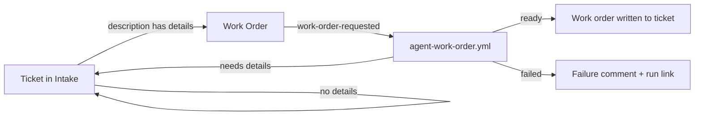

# jira-github-workflow-testing

Jira → GitHub agent workflows: Jira automation hands tickets to GitHub
Actions, where Claude Code does the preparation work (work orders today,
planning and implementation next) and the results are written back to the
ticket.

> **Current setup:** the agent workflows run on a self-hosted runner where
> Claude Code uses a personal Claude Pro subscription — no API key, nothing
> billed per run. [docs/runners.md](docs/runners.md) explains this and how to
> switch to the Claude API.

## Workflows

| Workflow | Trigger | What it does | Docs |
|---|---|---|---|
| [`agent-work-order.yml`](.github/workflows/agent-work-order.yml) | `work-order-requested` from Jira, or manual | Turns an intake ticket into a structured work order, or returns it for more detail | [work-order.md](docs/workflows/work-order.md) |
| [`tests.yml`](.github/workflows/tests.yml) | Pull requests, pushes to `main` | Lint + the test suite | [tests/README.md](tests/README.md) |
| [`agent-evals.yml`](.github/workflows/agent-evals.yml) | Manual | Live Claude evals of the agents' decisions | [tests/README.md](tests/README.md#live-evals) |

## Documentation

- [Architecture and conventions](docs/architecture.md) — how agent workflows are built; the standard every new workflow follows
- [Runners](docs/runners.md) — the self-hosted runner setup, and moving to the Claude API
- [Work order workflow](docs/workflows/work-order.md) — usage, Jira setup, edge cases, known gaps
- [Workflow doc template](docs/workflows/TEMPLATE.md) — start here for a new workflow
- [Contributing](CONTRIBUTING.md) — local setup, checks, and the definition of done
- [Tests](tests/README.md) — what's covered and how to run it
