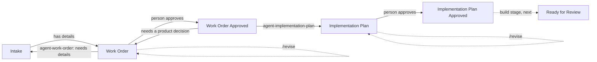

# Jira → GitHub agent workflows

Jira → GitHub agent workflows: Jira automation hands tickets to GitHub
Actions, where Claude Code does the preparation work — a work order, then a
technical implementation plan (implementation next) — and the results are
written back to the ticket. People approve each stage before the next starts.

Tickets waiting for a person (Work Order, Implementation Plan, later Ready for
Review) carry the `needs-human` label; the Jira rule for each approval removes
it. Any failure leaves the ticket where it is, with a comment linking to the
run. Commenting `/revise` and what to change asks the agent to revise its
work order or plan (or retry a failed run) — see
[Reverse paths](docs/jira.md#reverse-paths-sending-back-and-asking-for-changes).

Any repository can use them: add the files, register a runner, set a few
secrets, and point a Jira rule at the repository — no workflow edits. Start
with **[docs/setup.md](docs/setup.md)**.

> By default the agents run on a **self-hosted runner** where Claude Code is
> logged in to a **Claude subscription** (nothing billed per run). Switching to
> the **Claude API** is a secret and a variable — see
> [docs/runners.md](docs/runners.md). Claude is only used when a ticket or a
> person asks for it; tests, hooks and CI never use it — see
> [docs/claude-usage.md](docs/claude-usage.md).

## Workflows

| Workflow | Trigger | What it does | Docs |
|---|---|---|---|
| [`agent-work-order.yml`](.github/workflows/agent-work-order.yml) | `work-order-requested` from Jira, or manual | Turns an intake ticket into a structured work order, or returns it for more detail | [work-order.md](docs/workflows/work-order.md) |
| [`agent-implementation-plan.yml`](.github/workflows/agent-implementation-plan.yml) | `plan-requested` from Jira (work order approved), or manual | Researches the codebase and writes a technical implementation plan (attached, with a summary in the ticket), or returns the ticket with questions | [implementation-plan.md](docs/workflows/implementation-plan.md) |
| [`tests.yml`](.github/workflows/tests.yml) | Pull requests, pushes to `main` | Lint + the test suite | [tests/README.md](tests/README.md) |
| [`agent-evals.yml`](.github/workflows/agent-evals.yml) | Manual | Live Claude evals of the agents' decisions | [evals.md](docs/evals.md) |

## Documentation

- [Setup](docs/setup.md) — add the workflows to a repository and connect Jira
- [Jira setup](docs/jira.md) — statuses, labels, rules, sending tickets back and asking for changes (`/revise`), permissions, and what to automate in Jira
- [Architecture and conventions](docs/architecture.md) — how agent workflows are built; the standard every new workflow follows
- [Agent evals](docs/evals.md) — checking Claude's decisions: when it's worth the cost, the guards, how
- [When Claude is used](docs/claude-usage.md) — what causes Claude usage, tests vs evals, the eval notice, safeguards
- [Runners and Claude access](docs/runners.md) — self-hosted runner with a Claude subscription, or the Claude API
- [Work order workflow](docs/workflows/work-order.md) — usage, Jira setup, edge cases, known gaps
- [Implementation plan workflow](docs/workflows/implementation-plan.md) — usage, Jira setup, guardrails, edge cases
- [Workflow doc template](docs/workflows/TEMPLATE.md) — start here for a new workflow
- [Contributing](CONTRIBUTING.md) — local setup, checks, and the definition of done
- [Tests](tests/README.md) — what's covered and how to run it
