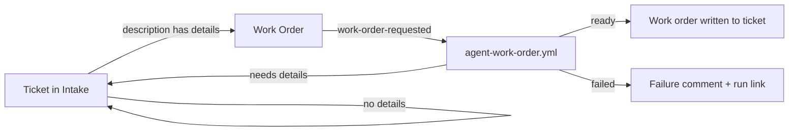

# Jira → GitHub agent workflows

Jira → GitHub agent workflows: Jira automation hands tickets to GitHub
Actions, where Claude Code does the preparation work (work orders today,
planning and implementation next) and the results are written back to the
ticket.

Any repository can use them: add the files, register a runner, set a few
secrets, and point a Jira rule at the repository — no workflow edits. Start
with **[docs/setup.md](docs/setup.md)**.

> By default the agents run on a **self-hosted runner** where Claude Code is
> logged in to a **Claude subscription** (nothing billed per run). Switching to
> the **Claude API** is a secret and a variable — see
> [docs/runners.md](docs/runners.md). Claude is only used when a ticket or a
> person asks for it; tests, hooks and CI never use it — see
> [docs/claude-usage.md](docs/claude-usage.md).

## Workflows

| Workflow | Trigger | What it does | Docs |
|---|---|---|---|
| [`agent-work-order.yml`](.github/workflows/agent-work-order.yml) | `work-order-requested` from Jira, or manual | Turns an intake ticket into a structured work order, or returns it for more detail | [work-order.md](docs/workflows/work-order.md) |
| [`tests.yml`](.github/workflows/tests.yml) | Pull requests, pushes to `main` | Lint + the test suite | [tests/README.md](tests/README.md) |
| [`agent-evals.yml`](.github/workflows/agent-evals.yml) | Manual | Live Claude evals of the agents' decisions | [evals.md](docs/evals.md) |

## Documentation

- [Setup](docs/setup.md) — add the workflows to a repository and connect Jira
- [Architecture and conventions](docs/architecture.md) — how agent workflows are built; the standard every new workflow follows
- [Agent evals](docs/evals.md) — why and when to check Claude's decisions, and how
- [When Claude is used](docs/claude-usage.md) — what causes Claude usage, tests vs evals, the eval reminder
- [Runners and Claude access](docs/runners.md) — self-hosted runner with a Claude subscription, or the Claude API
- [Work order workflow](docs/workflows/work-order.md) — usage, Jira setup, edge cases, known gaps
- [Workflow doc template](docs/workflows/TEMPLATE.md) — start here for a new workflow
- [Contributing](CONTRIBUTING.md) — local setup, checks, and the definition of done
- [Tests](tests/README.md) — what's covered and how to run it
