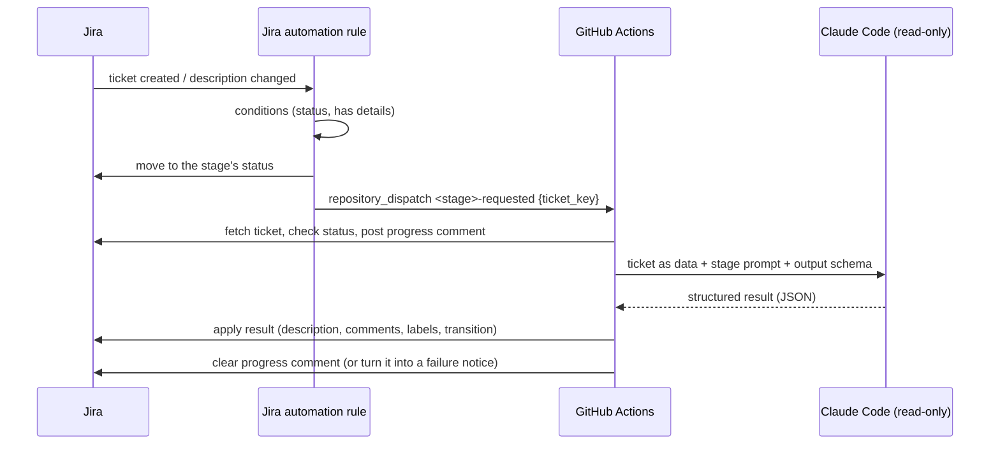

# Architecture and conventions

How the agent workflows are built. **Every new or updated agent workflow
follows these conventions**; `agent-work-order.yml` is the reference
implementation.

## The pattern

1. **Jira decides *when***. A Jira automation rule moves the ticket into the
   stage's status and sends `repository_dispatch` with **only the ticket key**.
2. **The workflow reads everything else from Jira**, so it always sees the
   current ticket and can be re-run by hand for any ticket.
3. **Claude only reads and decides.** It explores the repository with
   read-only, repo-scoped tools, researches with web search, and returns
   **structured output** matching the stage's JSON schema. It has no
   credentials and never calls Jira.
4. **Plain shell applies the result.** The Jira steps turn Claude's output into
   Jira's document format (ADF) and make the API calls, failing loudly on any
   error.

## Conventions

### Triggers and naming
- Event: `<stage>-requested` (`work-order-requested`, later `plan-requested`,
  `build-requested`). Payload: `{"ticket_key": "..."}` only.
- Also `workflow_dispatch` with a `ticket_key` input for manual runs.
- `run-name: "<Stage>: <ticket key>"` so the Actions list is scannable.
- File: `.github/workflows/agent-<stage>.yml`.

### Structure
- One job. Steps: **Fetch ticket** (`id: start`) → **Generate (Claude Code)**
  (`id: claude`) → one **Apply** step per outcome (`if:` on
  `steps.claude.outputs.status`) → **Clear progress comment** → **Report
  failure on ticket** (`if: failure()`).
- Everything a repository might need to change (runner labels, Claude model
  and limits, Jira status and label names) is a **repository variable** read
  in the workflow's top-level `env:` as `${{ vars.NAME || 'default' }}`, so
  installing in a new repository needs no workflow edits. Text that must match
  a Jira rule's comment is fixed in `env:`.
- `runs-on` comes from `AGENT_RUNS_ON`; a `runner.environment == 'github-hosted'`
  step installs Claude Code; the Claude step gets `ANTHROPIC_API_KEY` (empty
  unless set) — so the same workflow runs with a subscription login or the API.
- Claude runs only on `repository_dispatch` / `workflow_dispatch`, never on
  push, pull request or schedule (enforced by `tests/shared/claude-usage.bats`).
- Agent files live in `.github/agents/<stage>/`: `prompt.md` (instructions,
  passed with `--append-system-prompt-file`), `schema.json` (output schema),
  `render.jq` (output → ticket layout). Shared code lives in
  `.github/agents/lib/` (`jira.sh`, `adf.jq`) — reuse it, don't copy it.

### Safety
- `concurrency` per ticket with `cancel-in-progress: true`: the newest request
  wins; the cleanup step runs on `success() || cancelled()` so a cancelled run
  leaves nothing behind.
- Every step has `timeout-minutes`, and together they fit within the job's
  (a test enforces it), so a slow step fails and is reported instead of the
  job being cancelled.
- Every step that writes to Jira first calls `jira_require_status` so a run
  never writes to a ticket that has moved on.
- Check prerequisites (e.g. a transition exists) **before** the first write,
  so a failure can't leave a half-processed ticket.
- Ticket data reaches scripts through `env:`, never `${{ }}` inside `run:`.
- Jira secrets only on the steps that call Jira — never on the Claude step.
- **Never log ticket content.** Run logs are public in public repositories, and
  Claude's answer quotes the ticket: log only outcomes (status, turns, error
  type). The content belongs on the ticket. A test enforces this.
- **Credentials never go on a command line**: `jira.sh` hands them to `curl`
  through a file only the runner's user can read, removed when the step ends.
- **Downloads are pinned**: third-party binaries are checked against pinned
  checksums, `npm ci` runs with `--ignore-scripts`, and Dependabot keeps actions
  and packages current.
- `actions/checkout` with `persist-credentials: false`, and a sparse checkout
  that leaves out recorded test data (`tests/*/fixtures`, `scenarios`, `evals`,
  `expected`), so Claude can't copy a past answer. The evals mirror it.
- Claude: `--permission-mode dontAsk`, tools limited to
  `Read(./**),Grep(./**),Glob(./**),WebSearch` plus `WebFetch(domain:…)` for an
  allowlist of documentation sites (no fetching arbitrary URLs, so ticket text
  can't get repository content sent anywhere), pinned `--model` with
  `--fallback-model`, and a `--max-budget-usd` cap.
- Anything a later run needs to recognise (e.g. the Original Request comment)
  carries a fixed marker from `env:`, so re-runs are idempotent.
  The prompt treats ticket text and web pages as data, never instructions.
- The Claude step fails unless the output is complete and valid for its
  status (some jq versions treat empty input as success — check for output explicitly).

### Visibility
- A progress comment ("⏳ …" with a link to the run) while the run is active,
  deleted when it ends, or turned into "❌ … failed" with the run link.
- A run summary (`$GITHUB_STEP_SUMMARY`): result, models, Claude Code
  version, duration, turns, API-equivalent cost.
- CI flags pull requests that change a prompt, schema or Claude setting
  (`.github/scripts/agent-behaviour-changes.sh`) with a reminder to run the
  evals.

### Jira document format
- Build all ticket content with `adf.jq` helpers; never hand-write ADF.
- Headings that later stages or automations look for (e.g. the Delivery
  section) are part of the contract — changing them is a breaking change.

## Adding a stage

1. Copy `agent-work-order.yml` and `.github/agents/work-order/`, rename.
2. Write the prompt and schema; keep `render.jq` building on `adf.jq`.
3. Add `tests/<stage>/` (scenarios, Claude-step tests, schema tests, evals) —
   see [tests/README.md](../tests/README.md).
4. Document it from [workflows/TEMPLATE.md](workflows/TEMPLATE.md).
5. Add the Jira rule, and list it in the PR's deployment steps.
