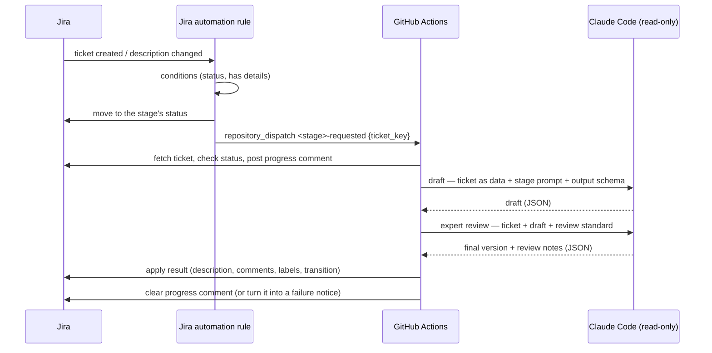

# Architecture and conventions

How the agent workflows are built. **Every new or updated agent workflow
follows these conventions**; `agent-work-order.yml` is the reference
implementation.

## The pattern

1. **Jira decides *when***. A Jira automation rule moves the ticket into the
   stage's status and sends `repository_dispatch` with **only the ticket key**.
2. **The workflow reads everything else from Jira**, so it always sees the
   current ticket and can be re-run by hand for any ticket.
3. **Claude only reads and decides.** It explores the repository with
   read-only, repo-scoped tools, researches with web search, and returns
   **structured output** matching the stage's JSON schema. It has no
   credentials and never calls Jira.
4. **An expert review is the last step before people see anything** (see
   below). Only reviewed output is applied; if the review fails, nothing is.
5. **Plain shell applies the result.** The Jira steps turn Claude's output into
   Jira's document format (ADF) and make the API calls, failing loudly on any
   error.

## Conventions

### Triggers and naming
- Event: `<stage>-requested` (`work-order-requested`, `plan-requested`, later
  `build-requested`). Payload: `{"ticket_key": "..."}` only.
- Also `workflow_dispatch` with a `ticket_key` input for manual runs.
- `run-name: "<Stage>: <ticket key>"` so the Actions list is scannable.
- File: `.github/workflows/agent-<stage>.yml`.

### Structure
- One job. Steps: **Fetch ticket** (`id: start`) → **Claude** (`id: claude`)
  → **Apply** (`id: apply`, `status == 'ready'`) or **Return** (`id: return`,
  the stage's bounce status) → **Clear progress comment** → **Report failure on
  ticket** (`if: failure()`). The test harness runs every stage with this
  shape.
- Steps stay short by calling the shared scripts — `lib/jira.sh` (Jira
  calls), `lib/stage.sh` (fetching, progress and failure comments, resolving,
  revision replies) and `lib/claude.sh` (draft, review, checks, summary);
  each function is documented where it's defined. Source `jira.sh` first, on
  its own line — the tests' Jira mock hooks in right after it.
- Claude's result is `status: ready` with the stage's payload (`work_order`,
  `plan`, …) or the stage's bounce status with its reason (`missing`,
  `questions`, …); `claude_check` enforces this.
- Output too large for a Jira field (the ~32k limit) is attached as Markdown
  (`jira_attach`) with a summary in the ticket, rendered from the same
  content, as the plan stage does.
- Everything a repository might need to change (runner labels, Claude model
  and limits, Jira status and label names) is a **repository variable** read
  in the workflow's top-level `env:` as `${{ vars.NAME || 'default' }}`, so
  installing in a new repository needs no workflow edits. Text that must match
  a Jira rule's comment is fixed in `env:`.
- `runs-on` comes from `AGENT_RUNS_ON`; a `runner.environment == 'github-hosted'`
  step installs Claude Code; the Claude step gets `ANTHROPIC_API_KEY` (empty
  unless set) — so the same workflow runs with a subscription login or the API.
- Claude runs only on `repository_dispatch` / `workflow_dispatch`, never on
  push, pull request or schedule (enforced by `tests/shared/claude-usage.bats`).
- Agent files live in `.github/agents/<stage>/`: `prompt.md` (instructions,
  passed with `--append-system-prompt-file`), `schema.json` (output schema),
  `render.jq` (output → ticket layout). Shared code lives in
  `.github/agents/lib/` (`jira.sh`, `stage.sh`, `claude.sh`, `adf.jq`) — reuse
  it, don't copy it.

### Expert review (every stage)
- Every stage's Claude step is **draft → check → review → check**
  (`claude_run`, `claude_check`, `claude_review`, `claude_check`), so the
  stage's own checks run on the reviewed version.
- **A draft that sends the ticket back isn't reviewed** (needs details, needs
  clarification): it changes nothing on the ticket but a comment, and a person
  picks it up next, so the review would only polish wording. The summary shows
  "skipped (sent back)".
- The review standard is shared (`lib/review.md`: verify claims, fix errors,
  check the decision, simplify, improve clarity, keep the format); each stage
  adds a checklist in `<stage>/review.md`.
- The reviewer may change the outcome (e.g. ready → needs clarification), with
  a reason. Its model and budget are `REVIEW_CLAUDE_*` repository variables.
- People see a short "Expert review: …" note with the result; detailed notes
  go only where they stay private (e.g. the plan attachment) — never logs,
  summaries or artifacts, which are public in public repositories.
- Future stages that produce something for people (the PR description, review
  comments) use the same step.

### Revisions and reverse paths (every stage)
Tickets don't only move forward: people add details, ask for changes, or send
a ticket back. Every stage that produces something for people handles this
the same way (the Jira side, and every path, is in
[jira.md](jira.md#reverse-paths-sending-back-and-asking-for-changes)):

- **One trigger: a `/revise` comment** (`JIRA_REVISE_COMMAND`). The Revision
  Requested rule dispatches the stage that owns the ticket's current status.
  The comment is both the request and the feedback; the same comment retries
  a failed run.
- **Scoped revisions, not reruns.** When the stage's output already exists,
  the run revises it (otherwise it writes a new one, using the comments as
  input). Claude follows `lib/revise.md` — research only what the requests
  touch, verify what changes, update anything else the change makes wrong —
  and returns only the changed sections, as `updates` (the stage's output
  with nothing required to `REVISION_DEPTH` levels; `claude_revision_schema`).
  The review checks them and the **whole revised document** for consistency
  (`<revised>`, from the stage's `revision_preview`; `lib/review-revision.md`).
  Only those sections are replaced, and the stage's checks run on them.
- **Every kind of request** — a specific change, extra details, a question
  (researched, answered, recorded where useful), a broad change, or a vague
  request (a clear reading applied and stated, or the reply asks what's
  needed).
- **The ticket is the source of truth.** People can edit the output by hand
  (the work order in the description; the plan by re-uploading its file) —
  that never starts a run, and it's what's approved, revised and passed on.
- **Headings are fixed.** Sections are found by heading: the agent only
  changes what's inside them (the tests check the heading list is
  unchanged), and a revision that needs a heading someone removed or renamed
  fails before changing anything, naming it.
- **Say what changed.** `revision_responses` → a "🔁 Change requests to the …"
  comment (`stage_revision_reply`); the requests are marked ✅ Resolved
  (`stage_resolve_revisions`) so later runs leave them out. A request that
  needs a decision takes the stage's send-back path and stays open.
- **The workflow decides what's a request, not Claude.** Claude gets the
  comments (minus the automation's own: ⏳, ❌, ✅ Resolved, 🔁) in two
  sections: "Change requests" — exactly the unresolved comments the Jira rule
  treats as `/revise` — and "Other comments", background only. Responses are
  one per listed request; questions about a request go in its response,
  never into the output. Superseded output is marked out of date, not
  silently left.
- **`needs-human` follows who's waiting** — added whenever a person must act
  (including after a failure), removed while the agent works and when the
  requester is the one to act.

A label or a "Changes requested" status were considered: both take two
actions (the signal, plus the feedback) and a status adds one per stage; a
comment command is one action and carries over to PR comments. For the PR
stage (not built yet) the options to decide then: people commit to the
branch; people leave review comments for the agent to apply; people ask the
agent to apply selected mid/low-severity review findings (e.g. `/apply 2 4`);
re-running the automated review after changes.

### Safety
- `concurrency` per ticket with `cancel-in-progress: true`: the newest request
  wins; the cleanup step runs on `success() || cancelled()` so a cancelled run
  leaves nothing behind.
- Every step has `timeout-minutes`, and together they fit within the job's
  (a test enforces it), so a slow step fails and is reported instead of the
  job being cancelled.
- Every step that writes to Jira first calls `jira_require_status` so a run
  never writes to a ticket that has moved on.
- Check prerequisites (e.g. a transition exists) **before** the first write,
  so a failure can't leave a half-processed ticket.
- Ticket data reaches scripts through `env:`, never `${{ }}` inside `run:`.
- Jira secrets only on the steps that call Jira — never on the Claude step.
- **Never log ticket content.** Run logs are public in public repositories, and
  Claude's answer quotes the ticket: log only outcomes (status, turns, error
  type). The content belongs on the ticket. A test enforces this.
- **Credentials never go on a command line**: `jira.sh` hands them to `curl`
  through a file only the runner's user can read, removed when the step ends.
- **Downloads are pinned**: third-party binaries are checked against pinned
  checksums, `npm ci` runs with `--ignore-scripts`, and Dependabot keeps actions
  and packages current.
- `actions/checkout` with `persist-credentials: false`, and a sparse checkout
  that leaves out recorded test data (`tests/*/fixtures`, `scenarios`, `evals`,
  `expected`), so Claude can't copy a past answer. The evals mirror it.
- Claude: `--permission-mode dontAsk`, tools limited to
  `Read(./**),Grep(./**),Glob(./**),WebSearch` plus `WebFetch(domain:…)` for an
  allowlist of documentation sites (no fetching arbitrary URLs, so ticket text
  can't get repository content sent anywhere), pinned `--model` with
  `--fallback-model`, and a `--max-budget-usd` cap.
- Claude isolation: `--disallowedTools "Bash,Write,Edit,NotebookEdit"` (deny
  rules also bind subagents; an allowlist alone doesn't when a subagent's
  definition grants a tool), `--setting-sources project` (the repository's
  settings and `CLAUDE.md`, never the runner owner's personal ones), and no hooks or MCP
  servers (`disableAllHooks`, `--strict-mcp-config`), which would run outside
  the tool rules.
- Anything a later run needs to recognise (e.g. the Original Request comment)
  carries a fixed marker from `env:`, so re-runs are idempotent.
  The prompt treats ticket text and web pages as data, never instructions.
- The Claude step fails unless the output is complete and valid for its
  status (some jq versions treat empty input as success — check for output explicitly).

### Visibility
- A progress comment ("⏳ …" with a link to the run) while the run is active,
  deleted when it ends, or turned into "❌ … failed" with the run link.
- **Failures say why.** A step that fails for a known reason uses
  `stage_fail "<reason>"`: the reason is logged and shown on the ticket as the
  failure comment's **Why:** line, with what to do next. Reasons name
  sections, positions, file paths or settings — never ticket content (logs
  are public).
- A run summary (`$GITHUB_STEP_SUMMARY`): result, models, Claude Code
  version, duration, and turns and API-equivalent cost per pass (draft,
  review).
- CI flags pull requests that change a prompt, schema or Claude setting
  (`.github/scripts/agent-behaviour-changes.sh`) with an informational
  notice; the evals themselves are manual, confirmed and used sparingly.

### Jira document format
- Build all ticket content with `adf.jq` helpers; never hand-write ADF.
- Headings that later stages or automations look for (e.g. the Delivery
  section) are part of the contract — changing them is a breaking change.

## Known gaps (every stage)

- **No automatic retries** for transient Jira or Claude errors — comment
  `/revise` to retry.
- **Only the first 100 comments** on a ticket are read (for Claude and for
  resolving).
- **Anyone who can comment can start a run** with `/revise` — restrict it in
  the Jira rule if needed ([jira.md](jira.md#rule-revision-requested)).
- **Expired credentials fail quietly.** An expired Jira token also stops the
  failure comment; an expired GitHub token in the rules means no run starts
  ([setup.md](setup.md#6-plan-for-credential-expiry)).
- **Posts as a person.** The automation acts as the `JIRA_EMAIL` user; a
  dedicated service account makes its actions distinguishable.
- **Evals are non-deterministic**, and revisions aren't covered by one yet.
- **No repository-specific agents yet.** A repository's `CLAUDE.md` is read,
  but its own subagents and skills aren't used; a supported way to add
  codebase expertise per stage is planned.

## Adding a stage

1. Copy `agent-work-order.yml` and `.github/agents/work-order/`, rename.
2. Write the prompt and schema; keep `render.jq` building on `adf.jq`.
3. Add `tests/<stage>/` (scenarios, Claude-step tests, schema tests, evals) —
   see [tests/README.md](../tests/README.md).
4. Handle revisions and reverse paths as above: a revision mode, a
   `revise.sh` (`REVISION_DEPTH`, `revision_preview`, and applying `updates`
   section by section to the current output), the `revision_responses`
   field, the reply and resolution, a scenario per path (including one
   proving untouched sections and manual edits survive), and the stage's
   statuses in the Revision Requested rule.
5. Document it from [workflows/TEMPLATE.md](workflows/TEMPLATE.md), including
   its reverse paths and the steps to test it in Jira.
6. Add the Jira rule, and list it in the PR's deployment steps.
