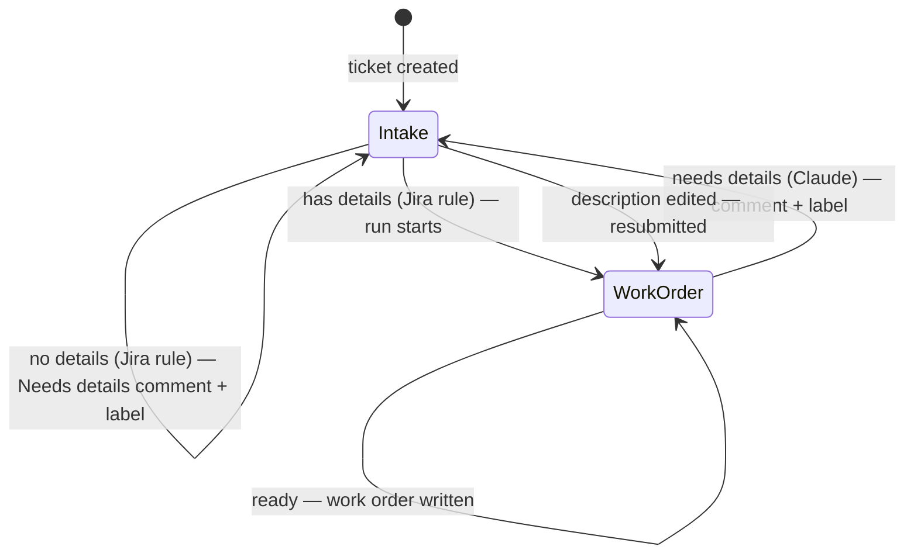

# Work order (`agent-work-order.yml`)

Turns an intake ticket into a structured work order a developer can start
technical planning from — or sends it back to the requester when there isn't
enough to work with.

| | |
|---|---|
| Trigger | `repository_dispatch` `work-order-requested` (Jira), or **Run workflow** with a ticket key |
| Runs on | `[self-hosted, claude]` — see [runners.md](../runners.md) |
| Model | `claude-sonnet-5` (`CLAUDE_MODEL`), falling back to `claude-opus-5-5` when overloaded; capped at $2 API-equivalent per run |
| Agent files | `.github/agents/work-order/` (prompt, schema, ticket layout) |
| Tests | `tests/work-order/` — see [Testing](#testing) |

## Ticket lifecycle



**Ready.** The description is replaced by the work order (Overview, Scope,
Developer Notes, Risk & Open Questions, Delivery — acceptance criteria as
checkboxes). The original intake form is kept as a comment, and earlier
"Needs details" comments are struck through and marked ✅ Resolved.

**Needs details.** A comment with the standard message, the source ("flagged
by Claude") and *What's missing*, the `needs-details` label, and the ticket
moves back to Intake. Editing the description resubmits it.

**Failed.** The progress comment becomes "❌ Work order generation failed" with
a link to the run log; the ticket stays in Work Order. Fix the cause, then
**Re-run jobs** on that run (or **Run workflow** with the ticket key).

## Jira setup

### Automation rule: "Work Order Requested"

| Part | Setting |
|---|---|
| Trigger | Multiple issue events: Issue created, Issue updated |
| Trigger conditions | Status = **Intake**; Issue type = the intake type |
| Block 1 | If Sprint is empty → set Sprint to current |
| Block 2 (gate), match **any** | `{{#changelog.description}}changed{{/}}` equals `changed` · `{{changelog}}` equals *(empty)* — i.e. only new tickets and description edits |
| → If has details | Smart values: `{{issue.description.replaceAll("(?m)^(\s*h[1-6]\..*\|[\s*_#-]*[^:\n]{1,80}:[\s*_]*\|\s*-{4,}\s*\|\s*[*#-]+\s*)$", "").trim()}}` does not equal *(empty)* → remove label `needs-details` → transition to **Work Order** → Send web request |
| → Else | Comment (once): the standard Needs details message → add label `needs-details` |
| Allow rule trigger | Off |

The web request: `POST https://api.github.com/repos/<owner>/<repo>/dispatches`,
headers `Authorization: Bearer <token>` (**hidden**), `Accept:
application/vnd.github+json`, body:

```json
{"event_type": "work-order-requested", "client_payload": {"ticket_key": "{{issue.key}}"}}
```

The token is a fine-grained GitHub token for this repository with
**Contents: Read and write**.

### Statuses, labels and text the workflow depends on
Set in the workflow's `env:`; keep them in sync with Jira:

| Setting | Value | Used for |
|---|---|---|
| `WORK_ORDER_STATUS` | Work Order | The run only acts on tickets in this status |
| `INTAKE_STATUS` | Intake | Where needs-details tickets go (needs a Work Order → Intake transition) |
| `NEEDS_DETAILS_LABEL` | needs-details | Added on bounce; removed by the rule on resubmit |
| `NEEDS_DETAILS_TITLE` | Needs details | How needs-details comments are recognised to resolve them — must match the rule's comment |
| `NEEDS_DETAILS_MESSAGE` | *(standard message)* | Must match the rule's comment text |
| `ORIGINAL_REQUEST_NOTE` | *(closing line of the Original Request comment)* | How a re-run recognises an already-captured request |
| `JIRA_NOTIFY_USERS` | true | `false` silences watcher notifications for the description update (needs Jira admin) |

### Claude settings
| Setting | Value | Used for |
|---|---|---|
| `CLAUDE_MODEL` / `CLAUDE_FALLBACK_MODEL` | claude-sonnet-5 / claude-opus-5-5 | The fallback is used automatically when the main model is overloaded |
| `CLAUDE_MAX_BUDGET_USD` | 2.00 | Stops a runaway run (API-equivalent dollars; typical work orders $0.10–0.80). On the current subscription it protects the plan's usage limits; with an API key it caps spend — see [runners.md](../runners.md) |
| `CLAUDE_FETCH_DOMAINS` | official docs sites | The only sites Claude can fetch pages from (search is unrestricted). Add a domain when work orders need its docs |

### Secrets and permissions
- Repository secrets: `JIRA_DOMAIN`, `JIRA_EMAIL`, `JIRA_API_TOKEN`.
- The `JIRA_EMAIL` account needs: Browse, Edit Issues, Transition Issues, Add
  Comments, **Delete Own Comments** (progress comment) and **Edit All
  Comments** (resolving the rule's needs-details comments).

## Edge cases

| Situation | Behaviour |
|---|---|
| Blank or template-only description | Stopped by the rule: stays in Intake, Needs details (Jira) comment + label, no run |
| Only placeholders / too vague | Claude returns needs-details → back to Intake |
| Title or other fields edited | Ignored — only description changes resubmit |
| Two saves in quick succession | Newest request cancels the older run (`concurrency`); the cancelled run removes its progress comment |
| Ticket moved while Claude works | Nothing written; progress comment cleared |
| Manual run on a ticket not in Work Order | No-op with a notice |
| No Work Order → Intake transition | Fails before changing anything; failure comment |
| Claude errors, times out, or returns incomplete output | Fails; failure comment |
| Jira rejects the description (e.g. too long) | Fails after the Original Request comment is posted; failure comment. A re-run doesn't post the original request again |
| A step runs too long | That step's time limit fails the run (reported on the ticket) before the job limit is reached |
| Budget exceeded | Fails; failure comment; the log shows `error_max_budget_usd` |
| Jira unreachable at the start | Fails; failure posted as a new comment |
| Invalid ticket key (manual run) | Rejected before any request |
| Ticket text tries to instruct Claude | Treated as data; Claude can only fetch pages from allowed documentation sites (covered by an eval) |

## Known gaps

- **Edits during a run are missed.** A description saved while the ticket is
  in Work Order doesn't trigger anything. Re-run the workflow, or move the
  ticket to Intake and edit again.
- **Description size.** Jira limits the description (~32k characters); an
  unusually long work order fails and reports it.
- **No automatic retries** for transient Jira or Claude errors — re-run.
- **Posts as a person.** The automation acts as the `JIRA_EMAIL` user; a
  dedicated service account would make its actions distinguishable and allow
  a rule condition to ignore them.
- **Claude can read recorded test fixtures** (`tests/work-order/fixtures`),
  including a past work order, which could influence similar tickets.
- **Evals are non-deterministic**: a passing run is evidence, not proof.

## Testing

- `npm test --prefix tests` — every path above with Jira mocked and Claude
  stubbed (`tests/work-order/scenarios.bats`, `claude-step.bats`,
  `schema.bats`), plus the shared libraries (`tests/shared/`).
- **Agent Evals** (Actions tab) or `npm run evals --prefix tests` — the real
  Claude against sample tickets (`tests/work-order/evals/cases/`).

See [tests/README.md](../../tests/README.md).
